# Setup

::: {.cell}

```{.r .cell-code}
library(dplyr)
library(tidyr)
library(stringr)
library(here)
library(readr)
library(ggplot2)
library(tibble)
library(patchwork)
library(ComplexUpset)
library(ggpattern)
library(gridpattern)
library(networkD3)
library(treemapify)
library(logistf)
library(Matrix)
library(rstatix)
library(goftest)

# load data
meta <- readRDS(here("data", "metadata.RDS"))
gene <- readRDS(here("data", "gene.RDS"))
contigs <- readRDS(here("data", "contig_list.RDS"))
amr <- readRDS(here("data", "amr.RDS"))
hvkp <- readRDS(here("data", "hvkp.RDS"))
ta <- readRDS(here("data", "toxin_antitoxin.RDS"))
meta_ncbi <- readRDS(here("data", "metadata_ncbi_enterobacterales.RDS"))
carbs_ncbi <- readRDS(here("data", "ncbi_enterobacterales_carbs.RDS"))
meta_raw <- readRDS(here("data", "metadata_raw.RDS"))
```
:::


# Figures

### Figure 1: Most common carbapenemase groups coloured by genomic location

::: {.cell}

```{.r .cell-code}
cupset_setup <- meta |> 
  separate_longer_delim(carb_group, delim = ", ") |> 
  select(accession, multicarb_location, genus, continent, isolation_source_group, carb_group) |> 
  distinct() |> 
  add_column(Present=1) |> 
  pivot_wider(names_from=carb_group, values_from=Present, values_fill = 0) |> 
  column_to_rownames("accession") |> 
  rename(`OXA-48-like` = OXA) |> 
  mutate(multicarb_location = factor(multicarb_location, levels = c("one plas", "two plas", "three or more plas", "one plas and chr", "two plas and chr", "three or more plas and chr", "chr")))
carb_list <- c("IMP", "KPC", "NDM", "OXA-48-like", "VIM")

upset_plt <- upset(cupset_setup, 
  carb_list,
  min_size = 5,
  name = "Carbapenemase combinations",
  base_annotations = list('Number of genomes' = intersection_size(mapping = aes(fill = multicarb_location), text = list(size = 3)) +
    scale_fill_manual(values = c("#ffc098", "#e9742a", "#93532a", "#f4c5ff", "#da62f5","#793a87", "#4182f3")) + 
    labs(fill = "Multi-carbapenemase\nlocation")),
  set_sizes=(upset_set_size() + 
    ylab('Count') + 
    theme(axis.text.x=element_text(angle=90, size = 8))),
  guides = "collect",
  width_ratio = 0.1);upset_plt
```

::: {.cell-output-display}
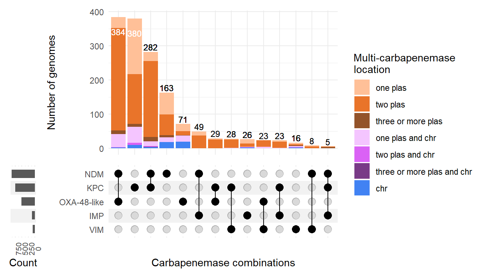{#fig-plot-1 width=672}
:::
:::


### Figure 2: Most common carbapenemase allelic combinations found across high-risk lineages

Note legend was coloured manually in Inkscape. 

::: {.cell}

```{.r .cell-code}
# set up stripe patterns
stripe_imp <- gridpattern::patternFill("stripe", fill = c("#D55E00", "#D55E00"), linewidth = NA, spacing = 0.1, density = 1)
stripe_imp_kpc <- gridpattern::patternFill("stripe", fill = c("#D55E00", "#56B4E9"), linewidth = NA, spacing = 0.1, density = 1)
stripe_imp_ndm <- gridpattern::patternFill("stripe", fill = c("#D55E00", "#E69F00"), linewidth = NA, spacing = 0.1, density = 1)
stripe_imp_oxa <- gridpattern::patternFill("stripe", fill = c("#D55E00", "#CC79A7"), linewidth = NA, spacing = 0.1, density = 1)
stripe_imp_vim <- gridpattern::patternFill("stripe", fill = c("#D55E00", "#0072B2"), linewidth = NA, spacing = 0.1, density = 1)
stripe_kpc <- gridpattern::patternFill("stripe", fill = c("#56B4E9", "#56B4E9"), linewidth = NA, spacing = 0.1, density = 1)
stripe_kpc_ndm <- gridpattern::patternFill("stripe", fill = c("#56B4E9", "#E69F00"), linewidth = NA, spacing = 0.1, density = 1)
stripe_kpc_oxa <- gridpattern::patternFill("stripe", fill = c("#56B4E9", "#CC79A7"), linewidth = NA, spacing = 0.1, density = 1)
stripe_kpc_oxa_vim <- gridpattern::patternFill("stripe", fill = c("#56B4E9", "#CC79A7", "#0072B2"), linewidth = NA, spacing = 0.1, density = 1)
stripe_kpc_vim <- gridpattern::patternFill("stripe", fill = c("#56B4E9", "#0072B2"), linewidth = NA, spacing = 0.1, density = 1)
stripe_ndm <- gridpattern::patternFill("stripe", fill = c("#E69F00", "#E69F00"), linewidth = NA, spacing = 0.1, density = 1)
stripe_ndm_oxa <- gridpattern::patternFill("stripe", fill = c("#E69F00", "#CC79A7"), linewidth = NA, spacing = 0.1, density = 1)
stripe_oxa <- gridpattern::patternFill("stripe", fill = c("#CC79A7", "#CC79A7"), linewidth = NA, spacing = 0.1, density = 1)
stripe_oxa_vim <- gridpattern::patternFill("stripe", fill = c("#CC79A7", "#0072B2"), linewidth = NA, spacing = 0.1, density = 1)
stripe_vim <- gridpattern::patternFill("stripe", fill = c("#0072B2", "#0072B2"), linewidth = NA, spacing = 0.1, density = 1)

meta |> 
  filter((genus == "Escherichia" & (mlst == "410" | mlst == "167" | mlst == "361")) |
  (str_detect(organism, "Klebsiella pneumoniae") & (mlst == "11" | mlst == "15" | mlst == "16" | mlst == "258" | mlst == "147" | mlst == "512")) | (genus == "Enterobacter" & (mlst == "171" | mlst == "79")) | (genus == "Citrobacter" & (mlst == "22"))) |> 
  count(genus, mlst, carb_group, carb) |> 
  mutate(carb_label = str_replace_all(carb, " ", "\n")) |> 
  mutate(carb_group = str_replace(carb_group, "OXA", "OXA-48-like")) |> 
  ggplot(aes(area=n, fill = carb_group)) +
  geom_treemap(color="white", show.legend = TRUE) + # fill = list(stripe_imp_ndm, stripe_kpc,stripe_kpc,stripe_kpc,stripe_kpc,stripe_kpc_ndm,stripe_kpc_oxa_vim,stripe_ndm_oxa,stripe_ndm_oxa,stripe_oxa,stripe_oxa,stripe_oxa_vim, stripe_vim,stripe_kpc,stripe_kpc,stripe_kpc,stripe_kpc,stripe_kpc,stripe_kpc_ndm,stripe_ndm,stripe_ndm,stripe_ndm,stripe_ndm_oxa, stripe_ndm,stripe_ndm,stripe_ndm,stripe_ndm,stripe_ndm,stripe_ndm_oxa, stripe_ndm_oxa,stripe_ndm_oxa,stripe_kpc_ndm,stripe_kpc_ndm,stripe_ndm,stripe_ndm,stripe_ndm_oxa,stripe_ndm_oxa,stripe_ndm_oxa,stripe_ndm_oxa,stripe_ndm_oxa,stripe_ndm,stripe_ndm,stripe_ndm,stripe_ndm_oxa,stripe_ndm_oxa,stripe_ndm_oxa,stripe_ndm_oxa,stripe_imp_kpc,stripe_imp_kpc,stripe_imp_oxa,stripe_kpc,stripe_kpc,stripe_kpc,stripe_kpc,stripe_kpc,stripe_kpc,stripe_kpc,stripe_kpc,stripe_kpc,stripe_kpc,stripe_kpc,stripe_kpc,stripe_kpc,stripe_kpc,stripe_kpc,stripe_kpc,stripe_kpc,stripe_kpc,stripe_kpc_ndm,stripe_kpc_ndm,stripe_kpc_ndm,stripe_kpc_ndm,stripe_kpc_ndm,stripe_kpc_ndm,stripe_kpc_ndm,stripe_kpc_ndm,stripe_kpc_ndm,stripe_kpc_ndm,stripe_kpc_ndm,stripe_kpc_oxa,stripe_kpc_oxa,stripe_kpc_vim,stripe_ndm,stripe_ndm,stripe_ndm,stripe_ndm,stripe_ndm,stripe_ndm_oxa,stripe_ndm_oxa,stripe_ndm_oxa,stripe_ndm_oxa,stripe_ndm_oxa,stripe_oxa,stripe_imp_kpc,stripe_imp_vim,stripe_kpc_ndm,stripe_kpc_oxa,stripe_kpc_vim,stripe_ndm,stripe_ndm,stripe_ndm_oxa,stripe_ndm_oxa,stripe_ndm_oxa,stripe_ndm_oxa,stripe_ndm_oxa,stripe_ndm_oxa,stripe_ndm_oxa,stripe_ndm_oxa,stripe_ndm_oxa,stripe_ndm_oxa,stripe_ndm_oxa,stripe_oxa,stripe_oxa,stripe_oxa,stripe_kpc,stripe_kpc,stripe_kpc,stripe_kpc_ndm,stripe_kpc_ndm,stripe_kpc_ndm,stripe_ndm,stripe_ndm,stripe_ndm,stripe_ndm_oxa,stripe_ndm_oxa,stripe_ndm_oxa,stripe_ndm_oxa,stripe_oxa,stripe_kpc,stripe_kpc_ndm,stripe_kpc_ndm,stripe_kpc_ndm,stripe_kpc_ndm,stripe_ndm,stripe_ndm_oxa,stripe_ndm_oxa,stripe_ndm_oxa,stripe_ndm_oxa,stripe_ndm_oxa,stripe_ndm_oxa,stripe_ndm_oxa,stripe_ndm_oxa,stripe_oxa,stripe_kpc,stripe_kpc,stripe_kpc,stripe_kpc,stripe_kpc,stripe_kpc,stripe_kpc,stripe_kpc,stripe_kpc,stripe_kpc,stripe_kpc,stripe_kpc_ndm,stripe_kpc_vim,stripe_kpc,stripe_kpc,stripe_kpc,stripe_kpc,stripe_kpc,stripe_kpc,stripe_kpc,stripe_kpc,stripe_kpc,stripe_kpc_ndm,stripe_kpc_oxa,stripe_kpc_oxa,stripe_kpc_oxa)) +
  geom_treemap_text(aes(label = paste0(n, "\n", carb_label)), place = "centre") +
  theme_bw() +
  facet_wrap(~ factor(mlst, levels = c("11", "16", "147", "258", "15", "512", "410", "167", "361", "171", "79", "22"), labels=c("K. pneumoniae\nST11\n(n=232)", "K. pneumoniae\nST16\n(n=62)","K. pneumoniae\nST147\n(n=57)","K. pneumoniae\nST258\n(n=60)","K. pneumoniae\nST15\n(n=39)","K. pneumoniae\nST512\n(n=31)","E. coli\nST410\n(n=30)","E. coli\nST167\n(n=15)","E. coli\nST361\n(n=13)","E. hormaechei\nST171\n(n=13)","E. hormaechei\nST79\n(n=13)","C. freundii\nST22\n(n=27)"))) +
  labs(fill = "Carbapenemase\ngroup")
# legend coloured manually in Inkscape
```

::: {.cell-output-display}
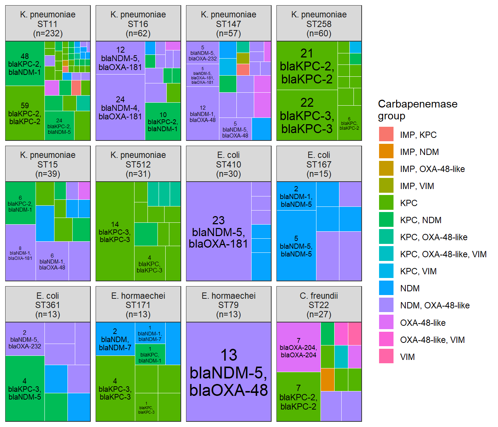{#fig-plot-2 width=672}
:::
:::


### Figure 4: Density of carbapenemase gene distances among proportion of plasmid length faceted by carbapenemase group


::: {.cell}

```{.r .cell-code}
tn2 <- gene |> 
  filter(location == "plasmid") |> 
  group_by(accession, contig_id, contig_length) |> 
  mutate(halfsize = contig_length/2) |>
  ungroup() 

plas_list <- gene |> filter(location == "plasmid") |> pull(contig_id) |> unique()
temp_list <- list()
for (i in 1:length(plas_list)){
  cnt <- tn2 |> filter(contig_id == plas_list[i]) |> nrow()
  
  temp <- tn2 |> filter(contig_id == plas_list[i])
  
  for (j in 1:cnt) {
    
    if(j < cnt){
    
    temp$diff2[j] <- ifelse((temp$start[j+1] - temp$start[j] < temp$halfsize[j]), 
            abs(temp$start[j+1] - temp$start[j]), 
            abs(temp$start[j+1] - temp$start[j] - temp$contig_length[j]))
           
    } else {
      
      temp$diff2[j] <-temp$start[1] + temp$contig_length[j] - temp$start[j]
    }
    
    temp_list[[i]] <- temp |> select(contig_id, start, diff2)
  }
}

tn3 <- tn2 |> left_join(bind_rows(temp_list), by = c("contig_id", "start"))

tn4 <- tn3 |> 
  filter(!(contig_length == diff2)) |> # remove those with only one carb on plas
  group_by(contig_id, contig_length, rep_type) |> 
  summarize(min = min(diff2)) |> 
  ungroup() |> 
  mutate(prop = min/contig_length) |> 
  left_join((gene |> group_by(contig_id) |> summarize(carb = toString(gene, sep = ", "))  |> filter(str_count(carb, ",") > 0)), by = "contig_id") |> 
  mutate(carb_group = case_when(
    str_detect(carb, "IMP") & str_detect(carb, "KPC") & str_detect(carb, "NDM") ~ "IMP, KPC, NDM",
    str_detect(carb, "IMP") & str_detect(carb, "KPC") & str_detect(carb, "OXA") ~ "IMP, KPC, OXA",
    str_detect(carb, "IMP") & str_detect(carb, "KPC") & str_detect(carb, "VIM") ~ "IMP, KPC, VIM",
    str_detect(carb, "IMP") & str_detect(carb, "NDM") & str_detect(carb, "OXA") ~ "IMP, NDM, OXA",
    str_detect(carb, "IMP") & str_detect(carb, "NDM") & str_detect(carb, "VIM") ~ "IMP, NDM, VIM",
    str_detect(carb, "IMP") & str_detect(carb, "OXA") & str_detect(carb, "VIM") ~ "IMP, OXA, VIM",
    str_detect(carb, "KPC") & str_detect(carb, "NDM") & str_detect(carb, "OXA") ~ "KPC, NDM, OXA",
    str_detect(carb, "KPC") & str_detect(carb, "NDM") & str_detect(carb, "VIM") ~ "KPC, NDM, VIM",
    str_detect(carb, "KPC") & str_detect(carb, "OXA") & str_detect(carb, "VIM") ~ "KPC, OXA, VIM",
    str_detect(carb, "NDM") & str_detect(carb, "OXA") & str_detect(carb, "VIM") ~ "NDM, OXA, VIM",
    str_detect(carb, "IMP") & str_detect(carb, "OXA") ~ "IMP, OXA",
    str_detect(carb, "IMP") & str_detect(carb, "NDM") ~ "IMP, NDM",
    str_detect(carb, "IMP") & str_detect(carb, "VIM") ~ "IMP, VIM",
    str_detect(carb, "IMP") & str_detect(carb, "KPC") ~ "IMP, KPC",
    str_detect(carb, "KPC") & str_detect(carb, "NDM") ~ "KPC, NDM",
    str_detect(carb, "KPC") & str_detect(carb, "OXA") ~ "KPC, OXA",
    str_detect(carb, "KPC") & str_detect(carb, "VIM") ~ "KPC, VIM",
    str_detect(carb, "NDM") & str_detect(carb, "OXA") ~ "NDM, OXA",
    str_detect(carb, "NDM") & str_detect(carb, "VIM") ~ "NDM, VIM",
    str_detect(carb, "OXA") & str_detect(carb, "VIM") ~ "OXA, VIM",
    str_detect(carb, "NDM") ~ "NDM",
    str_detect(carb, "OXA") ~ "OXA",
    str_detect(carb, "KPC") ~ "KPC",
    str_detect(carb, "IMP") ~ "IMP",
    str_detect(carb, "VIM") ~ "VIM",
    str_detect(carb, "IMI") ~ "IMI",
    TRUE ~ NA
  )) 

tn5 <- tn4 |> 
  mutate(carb_group = ifelse(carb_group != "NDM, OXA" & carb_group != "KPC, NDM" & carb_group != "KPC" & carb_group != "NDM" & carb_group != "OXA", "other", carb_group)) |> 
  mutate(carb_group = factor(carb_group, levels = c("KPC", "KPC, NDM", "NDM", "NDM, OXA", "OXA", "other"))) 

density_plt <- tn5 |>
  left_join(tn5 |> count(carb_group, name = "total_carb_group"), by = "carb_group") |> 
  mutate(label = paste0(carb_group, "\n(n=", total_carb_group, ")")) |> 
  mutate(label = str_replace(label, "OXA", "OXA-48-like")) |> 
  mutate(label = factor(label, levels = c("KPC\n(n=193)", "KPC, NDM\n(n=33)", "NDM\n(n=78)", "NDM, OXA-48-like\n(n=38)", "OXA-48-like\n(n=27)", "other\n(n=53)"))) |> 
  ggplot(aes(x = prop)) +
  geom_density(fill="#e9742a", color="#e9742a", alpha=0.5) +
  labs(y = "Density", x = "Plasmid length (proportion)") +
  facet_wrap(~ label, scales = "free_y") +
  theme_bw();density_plt
```

::: {.cell-output-display}
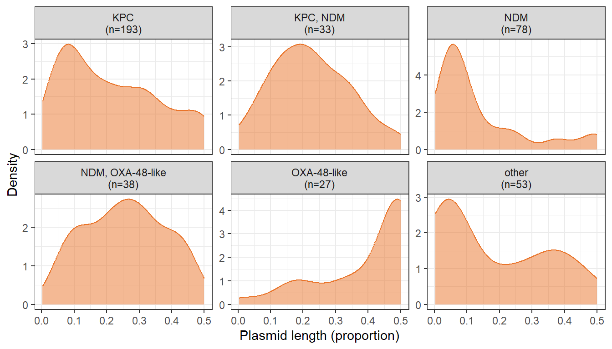{#fig-plot-4 width=672}
:::
:::


### Supplementary Figure 1: Proportion of all Enterobacterales genomes in NCBI (≤ 20 contigs) that encoded zero, one, or multiple carbapenemase genes


::: {.cell}

```{.r .cell-code}
ncbi_any_carb_accessions <- carbs_ncbi |> 
  distinct(accession) |> 
  pull()

ncbi_multicarb_accessions <- carbs_ncbi |> 
  count(accession)  |> 
  filter(n > 1) |> 
  pull(accession)

denominator <- meta_ncbi |> 
  filter(assembly_num_contigs <= 20)  |> 
  mutate(year = case_when(
    year == "-" ~ NA,
    year == "1016-08" ~ NA,
    str_detect(year, "-") ~ str_remove(year, "-.*"), 
    str_detect(year, "missing|Missing|unknown|N/A|n/a|na|not|Not|NOT|None|none|Unknown|restricted") ~ NA,
    str_detect(year, "/") ~ str_remove(year, ".*/"),
    TRUE ~ year)) |> 
  mutate(carb = ifelse(accession %in% ncbi_any_carb_accessions, "one", "none")) |> 
  mutate(carb = ifelse(accession %in% ncbi_multicarb_accessions, "multiple", carb)) |> 
  mutate(year = ifelse(year < 2000, "pre-2000", year)) |> 
  count(year, carb) |> 
  mutate(carb = factor(carb, levels = c("none", "one", "multiple"))) 

denom_a <- denominator |> 
  ggplot(aes(x = year, y = n, fill = carb)) +
  geom_bar(stat="identity") +
  theme_bw() +
  theme(axis.text.x = element_text(angle=90, vjust = 0.5)) +
  scale_fill_manual(values = c("cadetblue2", "cadetblue3", "cadetblue4")) +
  labs(y="Genome count\n(n=46,531 total)", x = "Year", fill="Carbapenemase\ngenes")

denom_b <- denominator |> 
  ggplot(aes(x = year, y = n, fill = carb)) +
  geom_bar(stat="identity",position="fill") +
  theme_bw() +
  theme(axis.text.x = element_text(angle=90, vjust = 0.5)) +
  scale_fill_manual(values = c("cadetblue2", "cadetblue3", "cadetblue4")) +
  labs(y="Genome proportion\n(n=46,531 total)", x = "Year", fill="Carbapenemase\ngenes")

denom_a + denom_b + plot_layout(nrow=2, guides = "collect") + plot_annotation(tag_level = "A")
```

::: {.cell-output-display}
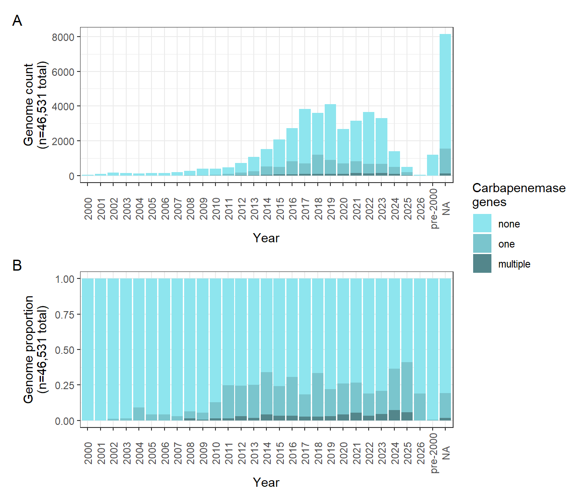{#fig-plot-s1 width=672}
:::
:::


### Supplementary Figure 2: Count of multi-carbapenemase combinations by continent over time


::: {.cell}

```{.r .cell-code}
continents <- meta |> 
  #filter(dereplicate == "unique") |> 
  mutate(carb_group_plotting = case_when(
    str_count(carb_group, ",") > 1 ~ "other",
    carb_group == "NDM, VIM" ~ "other",
    carb_group == "IMP, OXA" ~ "other",
    carb_group == "IMP, VIM" ~ "other",
    TRUE ~ carb_group )) |> 
  mutate(carb_group_plotting = factor(carb_group_plotting, levels = c("IMP", "IMP, KPC", "IMP, NDM", "KPC", "KPC, NDM", "KPC, OXA", "KPC, VIM", "NDM", "NDM, OXA", "OXA", "OXA, VIM", "VIM", "other"))) |>     
  mutate(carb_group_plotting = str_replace(carb_group_plotting, "OXA", "OXA-48-like")) |> 
  filter(!is.na(year)) |> 
  filter(!is.na(continent)) |> 
  left_join(meta |> count(continent, name = "total_continent"), by = "continent") |>  
  mutate(label = paste0(continent, "\n(n=", total_continent, ")")) |> 
  group_by(year, continent, label, carb_group_plotting)  |> 
  count() |> 
  ggplot(aes(x = year, y = n, fill = carb_group_plotting)) +
  geom_bar_pattern(stat="identity", position = "stack", aes(pattern_fill = carb_group_plotting), pattern_colour = NA, pattern_density = 0.5, pattern_spacing = 0.02) + 
  theme_bw() +
  facet_wrap(~label)+
  scale_fill_manual(values = c("#D55E00", "#D55E00", "#D55E00", "#56B4E9", "#56B4E9", "#56B4E9", "#56B4E9", "#E69F00", "#E69F00", "#CC79A7", "#CC79A7", "#0072B2", "grey")) +
  scale_pattern_fill_manual(values = c("#D55E00", "#56B4E9", "#E69F00", "#56B4E9", "#E69F00", "#CC79A7", "#0072B2", "#E69F00", "#CC79A7", "#CC79A7", "#0072B2", "#0072B2", "grey")) +
  labs(fill = "Carbapenemase\ngroup", y = "Number of\ngenomes", x = "Year of collection", pattern_fill = "Carbapenemase\ngroup") +
  theme(axis.text.x = element_text(angle=90, vjust = 0.5, size = 6));continents
```

::: {.cell-output-display}
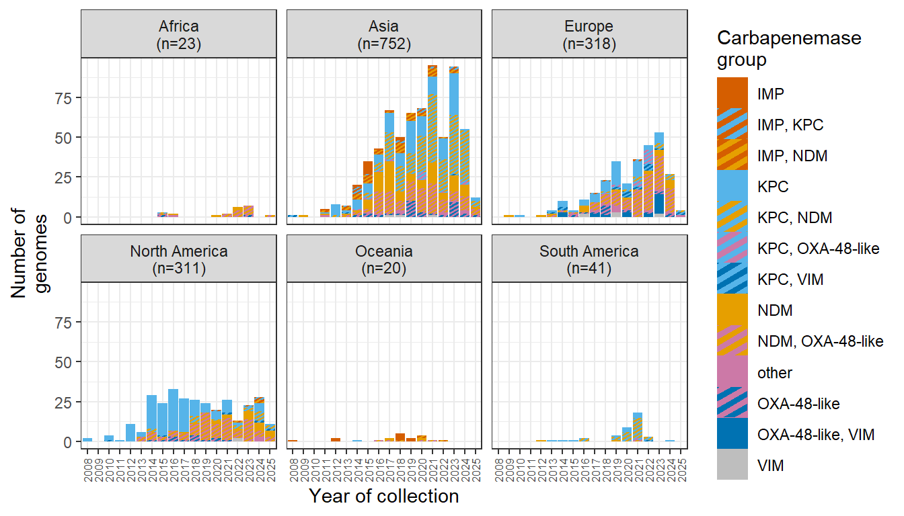{#fig-plot-s2 width=672}
:::
:::


### Supplementary Figure 3: Linkage between carbapenemase allele combinations


::: {.cell}

```{.r .cell-code}
doubles <- meta |> 
  #filter for samples that have only two carbs, exclude those with more
  filter(str_count(carb, ",") == 1) |> 
  mutate(carb = str_remove_all(carb, "bla")) |> 
  separate_wider_delim(carb, delim = ", ", names = c("carb1", "carb2"), too_few = "align_start") |> 
    mutate(carb1 = case_when(
    carb1 == "IMP" ~ "IMP novel",
    carb1 == "KPC" ~ "KPC novel",
    carb1 == "NDM" ~ "NDM novel",
    carb1 == "OXA" ~ "OXA-48-like novel",
    carb1 == "VIM" ~ "VIM novel",
    TRUE ~ carb1)) |> 
  mutate(carb2 = case_when(
    carb2 == "IMP" ~ "IMP novel",
    carb2 == "KPC" ~ "KPC novel",
    carb2 == "NDM" ~ "NDM novel",
    carb2 == "OXA" ~ "OXA-48-like novel",
    carb2 == "VIM" ~ "VIM novel",
    TRUE ~ carb2)) |> 
  select(source = carb1, target = carb2) 

# add unique names to each carb column so we don't get insane loopy plots by default
doubles$source <- paste0(doubles$source, "_q41")
doubles$target <- paste0(doubles$target, "_q42")

# filter out triples 
triples <- meta |> 
  filter(str_count(carb, ",") == 2) |> 
  mutate(carb = str_remove_all(carb, "bla")) |> 
  separate_wider_delim(carb, delim = ", ", names = c("carb1", "carb2", "carb3"), too_few = "align_start") |> 
  mutate(carb1 = case_when(
    carb1 == "IMP" ~ "IMP novel",
    carb1 == "KPC" ~ "KPC novel",
    carb1 == "NDM" ~ "NDM novel",
    carb1 == "OXA" ~ "OXA-48-like novel",
    carb1 == "VIM" ~ "VIM novel",
    TRUE ~ carb1)) |> 
  mutate(carb2 = case_when(
    carb2 == "IMP" ~ "IMP novel",
    carb2 == "KPC" ~ "KPC novel",
    carb2 == "NDM" ~ "NDM novel",
    carb2 == "OXA" ~ "OXA-48-like novel",
    carb2 == "VIM" ~ "VIM novel",
    TRUE ~ carb2)) |> 
  mutate(carb3 = case_when(
    carb3 == "IMP" ~ "IMP novel",
    carb3 == "KPC" ~ "KPC novel",
    carb3 == "NDM" ~ "NDM novel",
    carb3 == "OXA" ~ "OXA-48-like novel",
    carb3 == "VIM" ~ "VIM novel",
    TRUE ~ carb3)) |> 
  select(carb1, carb2, carb3)

# add unique names to each carb column so we don't get insane loopy plots by default
triples$carb1 <- paste0(triples$carb1, "_q41")
triples$carb2 <- paste0(triples$carb2, "_q42")
triples$carb3 <- paste0(triples$carb3, "_q43")

# make a new df that splits out carb2 and carb3 
temp <- triples |> 
  select(carb1 = carb2, carb2 = carb3)

# select carb1 and carb2 from original df, and bind to the carb2 and carb3 temp df. this capture first and second pair of every triple into two columns 
triples_condensed <- triples |> 
  select(carb1, carb2) |> 
  rbind(temp) |> 
  select(source = carb1, target = carb2) 

# combine the triples dataset with the doubles from above and count pairs 
all_condensed <- rbind(doubles, triples_condensed) |> 
  count(source, target, name = "value") |> 
  arrange(source, target)

# assign node numbers/row numbers and add group value for color
nodes <- data.frame(name = c(as.character(all_condensed$source), as.character(all_condensed$target)) |> unique()) |> 
  mutate(group = case_when(
    str_detect(name, "IMP") ~ "IMP",
    str_detect(name, "KPC") ~ "KPC",
    str_detect(name, "NDM") ~ "NDM",
    str_detect(name, "OXA") ~ "OXA",
    str_detect(name, "VIM") ~ "VIM",
    TRUE ~ NA)) 

# assign row number from nodes 
all_condensed$IDsource <- match(all_condensed$source, nodes$name)-1 
all_condensed$IDtarget <- match(all_condensed$target, nodes$name)-1

# remove gross suffix from plot
nodes$name <- sub('_q4[1-3]$', '', nodes$name)

# specify colors of bars
my_color <- 'd3.scaleOrdinal() .domain(["IMP", "KPC", "NDM", "OXA", "VIM"]) .range(["#D55E00", "#56B4E9", "#E69F00", "#CC79A7",  "#0072B2"])'

# plot
sankeyNetwork(Links = all_condensed, Nodes = nodes,
              Source = "IDsource", Target = "IDtarget",
              Value = "value", NodeID = "name",
              colourScale = my_color, NodeGroup="group", 
              iterations = 0,
              sinksRight=FALSE, fontSize = 12, nodeWidth = 30, fontFamily = "sans-serif")
```

::: {#fig-plot-s3 .cell-output-display}

```{=html}
<div class="sankeyNetwork html-widget html-fill-item" id="htmlwidget-3f4821b579becda43589" style="width:100%;height:742px;"></div>
<script type="application/json" data-for="htmlwidget-3f4821b579becda43589">{"x":{"links":{"source":[0,1,2,2,3,3,3,3,3,4,5,6,7,7,7,7,8,9,10,10,10,10,10,10,11,12,12,12,12,13,14,15,16,16,16,16,17,17,17,18,19,20,21,22,23,23,24,25,26,27,27,28,29,29,30,31,31,31,31,31,31,31,31,31,31,31,31,31,31,31,31,31,32,32,32,32,33,34,34,34,35,36,36,36,36,36,36,36,36,36,37,37,38,39,39,39,39,39,40,41,42,43,44,45,46,46,46,46,46,46,46,47,47,47,48,49,50,50,50,50,50,50,50,50,50,50,50,51,51,51,51,51,51,52,53,54,54,54,55,55,56,56,56,56,56,56,56,56,56,56,57,57,57,57,58,59,59,59,59,60,61,62,62,62,63,63,63,64,65,66,66,67,67,68,69,70,70,70,70,70,71,71,72,72,72,73,73,74,75,76,77,78],"target":[4,32,37,73,4,32,51,63,77,79,32,77,8,32,51,80,81,11,11,82,32,37,51,60,83,13,32,57,73,84,32,32,17,32,37,51,85,86,87,63,63,32,88,89,90,51,32,91,92,93,77,37,94,51,95,32,96,37,40,47,97,51,57,60,98,63,67,71,73,75,77,80,99,87,100,101,102,96,51,63,103,102,37,40,51,57,60,73,77,104,86,87,105,40,106,51,60,77,107,108,51,109,106,110,47,51,55,57,60,63,67,111,87,100,49,112,51,55,57,60,63,67,69,71,73,77,113,87,100,114,115,116,117,118,119,55,63,73,115,120,57,121,122,98,63,67,69,71,123,73,100,115,120,116,124,60,63,73,77,114,77,63,73,77,115,116,101,65,125,67,73,120,116,69,126,63,67,69,71,73,115,120,73,77,104,116,101,77,101,77,101,127],"value":[1,1,1,2,11,1,6,1,1,2,2,1,1,1,4,1,1,1,8,1,12,2,36,2,2,2,5,1,1,1,1,1,10,26,16,1,2,1,1,1,1,1,2,1,4,1,1,1,1,1,1,1,1,1,1,190,1,3,2,3,9,175,39,3,1,2,1,1,15,1,18,2,26,13,5,1,2,5,2,1,1,1,97,1,12,8,4,7,2,1,17,1,2,5,1,1,2,1,1,2,1,1,1,2,3,8,2,9,3,2,1,1,1,1,1,1,65,3,7,3,22,42,5,1,80,5,1,16,2,1,1,4,2,1,1,1,26,1,1,1,46,2,1,1,85,42,4,1,3,45,8,5,3,2,1,4,1,1,2,1,1,13,1,1,11,1,1,8,1,10,2,5,1,10,5,3,5,2,3,1,1,1,12,19,1,1,1,2,1,9,3,3]},"nodes":{"name":["IMP novel","IMP-11","IMP-13","IMP-1","IMP-1","IMP-22","IMP-23","IMP-26","IMP-26","IMP-38","IMP-4","IMP-4","IMP-8","IMP-8","IMP-94","IMP-96","KPC novel","KPC novel","KPC-121","KPC-125","KPC-126","KPC-12","KPC-144","KPC-14","KPC-157","KPC-160","KPC-189","KPC-18","KPC-20","KPC-25","KPC-264","KPC-2","KPC-2","KPC-31","KPC-33","KPC-35","KPC-3","KPC-3","KPC-44","KPC-4","KPC-4","KPC-53","KPC-5","KPC-66","KPC-6","KPC-8","NDM novel","NDM novel","NDM-16b","NDM-16b","NDM-1","NDM-1","NDM-24","NDM-3","NDM-4","NDM-4","NDM-5","NDM-5","NDM-6","NDM-7","NDM-7","OXA-162","OXA-181","OXA-181","OXA-204","OXA-204","OXA-232","OXA-232","OXA-244","OXA-244","OXA-48-like novel","OXA-48-like novel","OXA-48","OXA-48","VIM novel","VIM novel","VIM-1","VIM-1","VIM-4","IMP-1","VIM-4","IMP-26","IMP-69","IMP-4","IMP-8","KPC novel","KPC-3","NDM-1","KPC-12","KPC-144","KPC-14","KPC-160","KPC-189","KPC-18","KPC-25","KPC-264","KPC-33","NDM-13","OXA-163","KPC-2","NDM-5","VIM-1","KPC-31","KPC-35","VIM-2","KPC-44","KPC-6","KPC-4","KPC-53","KPC-66","KPC-8","NDM novel","NDM-16b","VIM-86","NDM-7","OXA-181","OXA-48","VIM-24","NDM-24","NDM-3","OXA-232","OXA-1181","OXA-1207","OXA-484","NDM-6","OXA-204","OXA-244","VIM-75"],"group":["IMP","IMP","IMP","IMP","IMP","IMP","IMP","IMP","IMP","IMP","IMP","IMP","IMP","IMP","IMP","IMP","KPC","KPC","KPC","KPC","KPC","KPC","KPC","KPC","KPC","KPC","KPC","KPC","KPC","KPC","KPC","KPC","KPC","KPC","KPC","KPC","KPC","KPC","KPC","KPC","KPC","KPC","KPC","KPC","KPC","KPC","NDM","NDM","NDM","NDM","NDM","NDM","NDM","NDM","NDM","NDM","NDM","NDM","NDM","NDM","NDM","OXA","OXA","OXA","OXA","OXA","OXA","OXA","OXA","OXA","OXA","OXA","OXA","OXA","VIM","VIM","VIM","VIM","VIM","IMP","VIM","IMP","IMP","IMP","IMP","KPC","KPC","NDM","KPC","KPC","KPC","KPC","KPC","KPC","KPC","KPC","KPC","NDM","OXA","KPC","NDM","VIM","KPC","KPC","VIM","KPC","KPC","KPC","KPC","KPC","KPC","NDM","NDM","VIM","NDM","OXA","OXA","VIM","NDM","NDM","OXA","OXA","OXA","OXA","NDM","OXA","OXA","VIM"]},"options":{"NodeID":"name","NodeGroup":"group","LinkGroup":null,"colourScale":"d3.scaleOrdinal() .domain([\"IMP\", \"KPC\", \"NDM\", \"OXA\", \"VIM\"]) .range([\"#D55E00\", \"#56B4E9\", \"#E69F00\", \"#CC79A7\",  \"#0072B2\"])","fontSize":12,"fontFamily":"sans-serif","nodeWidth":30,"nodePadding":10,"units":"","margin":{"top":null,"right":null,"bottom":null,"left":null},"iterations":0,"sinksRight":false}},"evals":[],"jsHooks":[]}</script>
```


Linkage between carbapenemase allele combinations.
:::
:::


### Supplementary Figure 4: Heatmap of carbapenemase allele combinations for genomes with two carbapenemase genes 


::: {.cell}

```{.r .cell-code}
combos <- meta |> 
  filter(str_count(carb, ",") == 1) |> 
  separate_wider_delim(carb, delim = ", ", names = c("carb1", "carb2")) |> 
  select(accession, carb1, carb2) |> 
  group_by(carb1, carb2) |> 
  count() |> 
  pivot_wider(id_cols = carb1, names_from = carb2, values_from = n) |> 
  pivot_longer(cols = !carb1, names_to = "carb2", values_to = "value") |> 
  ungroup() |> 
  mutate(carb1 = str_remove(carb1, "bla")) |> 
  mutate(carb2 = str_remove(carb2, "bla"))

# All possible values across BOTH columns
all_carbs <- sort(unique(c(combos$carb1, combos$carb2)))

combos3 <- tibble(carb1 = all_carbs, carb2 = all_carbs) |> 
  complete(carb1, carb2) |> 
  left_join(combos, by = c("carb1", "carb2")) |> 
  left_join((combos |> filter(carb1 != carb2)), by = c("carb1" = "carb2", "carb2" = "carb1")) |> 
  mutate_all(~replace(., is.na(.), 0)) |> 
  mutate(value = value.x + value.y) |> 
  select(carb1, carb2, value) |> 
  mutate(value = ifelse(value == 0, NA, value))  |> 
  mutate(carb1 = case_when(
    carb1 == "IMP" ~ "IMP novel",
    carb1 == "KPC" ~ "KPC novel",
    carb1 == "NDM" ~ "NDM novel",
    carb1 == "OXA" ~ "OXA-48-like novel",
    carb1 == "VIM" ~ "VIM novel",
    TRUE ~ carb1)) |> 
  mutate(carb2 = case_when(
    carb2 == "IMP" ~ "IMP novel",
    carb2 == "KPC" ~ "KPC novel",
    carb2 == "NDM" ~ "NDM novel",
    carb2 == "OXA" ~ "OXA-48-like novel",
    carb2 == "VIM" ~ "VIM novel",
    TRUE ~ carb2)) |> 
  mutate(carb1 = factor(carb1, levels = c("IMP-1","IMP-4","IMP-8","IMP-13","IMP-22","IMP-23","IMP-26","IMP-38","IMP-69","IMP-94","IMP-96","IMP novel","KPC-2","KPC-3","KPC-4","KPC-5","KPC-6","KPC-8","KPC-12","KPC-14","KPC-18","KPC-20","KPC-25","KPC-31","KPC-33","KPC-35","KPC-44","KPC-53","KPC-66","KPC-121","KPC-125","KPC-126","KPC-144","KPC-157","KPC-160","KPC-189","KPC-264","KPC novel","NDM-1","NDM-3","NDM-4","NDM-5","NDM-6","NDM-7","NDM-13","NDM-24","NDM novel","OXA-48","OXA-162","OXA-163","OXA-181","OXA-204","OXA-232","OXA-244","OXA-484","OXA-1181","OXA-1207","OXA-48-like novel","VIM-1","VIM-2","VIM-4","VIM-75","VIM-86","VIM novel"))) |> 
  mutate(carb2 = factor(carb2, levels = c("IMP-1","IMP-4","IMP-8","IMP-13","IMP-22","IMP-23","IMP-26","IMP-38","IMP-69","IMP-94","IMP-96","IMP novel","KPC-2","KPC-3","KPC-4","KPC-5","KPC-6","KPC-8","KPC-12","KPC-14","KPC-18","KPC-20","KPC-25","KPC-31","KPC-33","KPC-35","KPC-44","KPC-53","KPC-66","KPC-121","KPC-125","KPC-126","KPC-144","KPC-157","KPC-160","KPC-189","KPC-264","KPC novel","NDM-1","NDM-3","NDM-4","NDM-5","NDM-6","NDM-7","NDM-13","NDM-24","NDM novel","OXA-48","OXA-162","OXA-163","OXA-181","OXA-204","OXA-232","OXA-244","OXA-484","OXA-1181","OXA-1207","OXA-48-like novel","VIM-1","VIM-2","VIM-4","VIM-75","VIM-86","VIM novel")))  

heatmap <- combos3 |> 
  ggplot(aes(x = carb1, y = carb2, fill = value)) +
  geom_tile(color = "grey90") +
  geom_text(aes(label = ifelse(value > 0, value, "")), color = "white", size = 2) +
  theme_minimal()+
  theme(axis.text.x = element_text(angle = 90, vjust =0.5, hjust = 0.9, size=6),
    axis.text.y = element_text(size = 6)) +
  scale_fill_gradient(na.value="white", high="#264040",low="cadetblue3") +
  labs(fill = "Count", x = "Carbapenemase 1", y = "Carbapenemase 2");heatmap
```

::: {.cell-output-display}
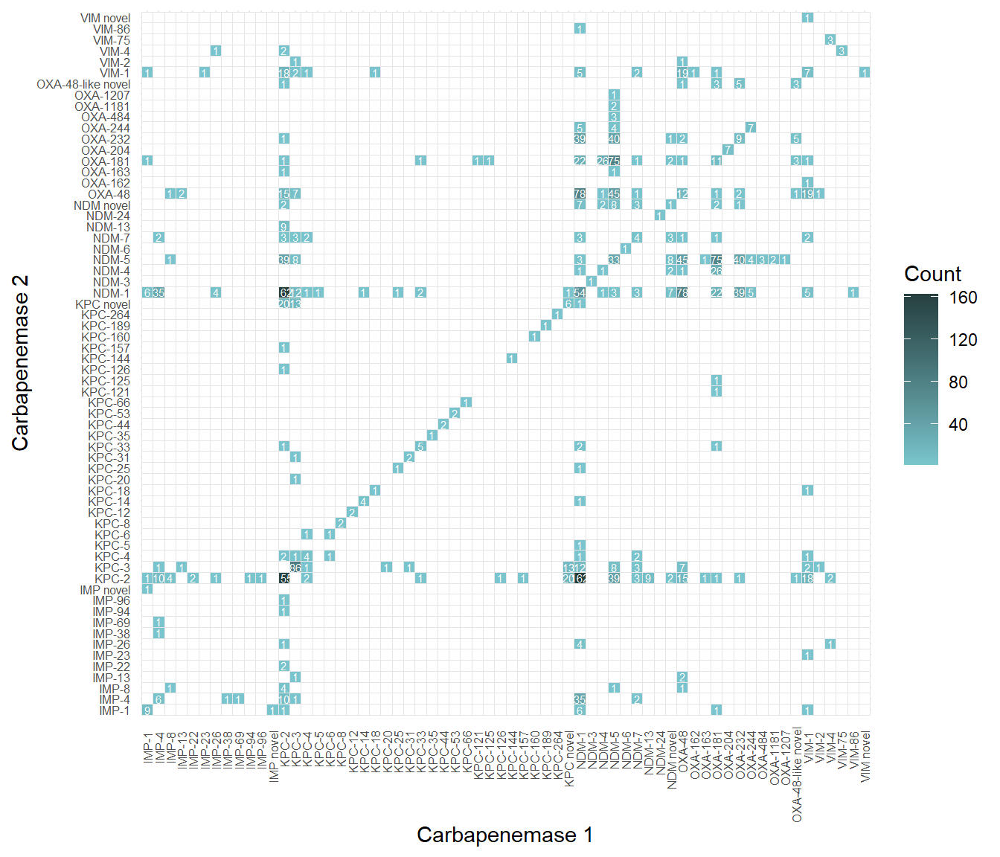{#fig-plot-s4 width=672}
:::
:::


### Supplementary Figure 5: Most common carbapenemase allelic combinations found across different genera


::: {.cell}

```{.r .cell-code}
meta_carb <- meta  |> 
  #filter(dereplicate == "unique") |> 
  mutate(carb = ifelse(carb %in% (meta |> count(carb) |> filter(n > 9) |> pull(carb)), carb, "other")) |> 
  #mutate(carb = ifelse(carb %in% (meta |> filter(dereplicate == "unique") |> count(carb) |> filter(n > 9) |> pull(carb)), carb, "other")) |> 
  count(carb, genus)  |> 
  ungroup() |> 
  arrange(desc(n))  

genus <- meta_carb |> 
  mutate(carb = str_remove_all(carb, "bla")) |> 
  ggplot(aes(x=n, y = reorder(carb, n, FUN="sum"), fill = genus)) +
  geom_bar(stat="identity") +
  geom_text(data = (meta_carb |> mutate(carb = str_remove_all(carb, "bla")) |> group_by(carb)  |> summarize(n_genus = n_distinct(genus), n = sum(n), genus = "Klebsiella")), aes(y = carb, x = n, label = n_genus), hjust = -0.1, show.legend = FALSE, size = 3) +
  theme_bw() +
  labs(x = "Number of genomes", y = "Carbapenemase combinations\n(present in 10 or more genomes)", fill = "Genus") +
  theme(plot.margin = unit(c(0.5,0.5,0.5,0.5), "cm")) +
  scale_x_continuous(limits = c(0, 460)) +
  scale_fill_manual(values = c("#A6CEE3", "#1F78B4", "#B2DF8A", "#33A02C", "#FB9A99", "#E31A1C", "#FDBF6F", "#FF7F00", "#CAB2D6", "#6A3D9A", "#FFFF99", "#B15928"));genus
```

::: {.cell-output-display}
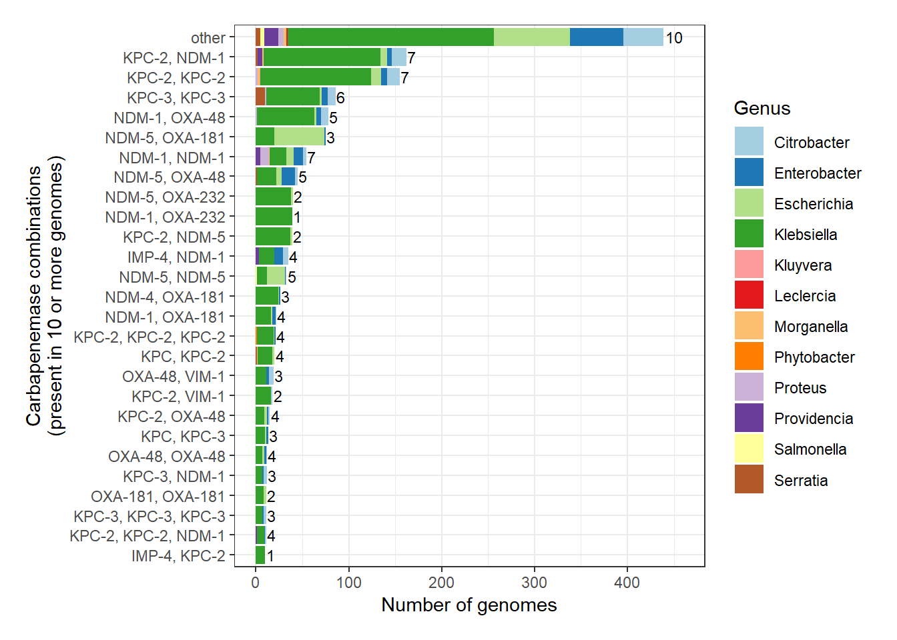{#fig-plot-s5 width=672}
:::
:::


### Supplementary Figure 6: Genomes with three or more carbapenemases


::: {.cell}

```{.r .cell-code}
tri_carb <- meta |> 
  filter(carb_count > 2)  |>  
  mutate(allele_description = case_when(
    multicarb_type == "same alleles" ~ "same alleles",
    carb == "blaKPC-2, blaKPC-2, blaNDM-1" ~ "at least one duplicated\nallele plus other gene(s)",
    carb == "blaNDM-5, blaOXA-181, blaOXA-181" ~ "at least one duplicated\nallele plus other gene(s)",
    carb == "blaKPC-2, blaNDM-1, blaNDM-1" ~ "at least one duplicated\nallele plus other gene(s)",
    carb == "blaKPC, blaKPC-2, blaKPC-2" ~ "at least one duplicated\nallele plus other gene(s)",
    carb == "blaNDM-5, blaNDM-5, blaOXA-181" ~ "at least one duplicated\nallele plus other gene(s)",
    carb == "blaKPC, blaKPC-3, blaKPC-3" ~ "at least one duplicated\nallele plus other gene(s)",
    carb == "blaKPC-2, blaKPC-2, blaNDM-5" ~ "at least one duplicated\nallele plus other gene(s)",
    carb == "blaKPC-2, blaKPC-3, blaKPC-3" ~ "at least one duplicated\nallele plus other gene(s)",
    carb == "blaKPC-2, blaNDM-1, blaOXA-48" ~ "distinct alleles",
    carb == "blaNDM-1, blaNDM-5, blaOXA-232" ~ "distinct alleles",
    carb == "blaKPC, blaKPC-2, blaKPC-2, blaKPC-25" ~ "at least one duplicated\nallele plus other gene(s)",
    carb == "blaKPC-2, blaKPC-2, blaKPC-2, blaKPC-2, blaKPC-2, blaNDM-1" ~ "at least one duplicated\nallele plus other gene(s)",
    carb == "blaKPC-2, blaKPC-2, blaNDM-1, blaNDM-1" ~ "at least one duplicated\nallele plus other gene(s)",
    carb == "blaKPC-2, blaNDM-1, blaNDM-5" ~ "distinct alleles",
    carb == "blaKPC-2, blaNDM-1, blaVIM-24" ~ "distinct alleles",
    carb == "blaNDM, blaNDM-1, blaNDM-1" ~ "at least one duplicated\nallele plus other gene(s)",
    carb == "blaNDM-1, blaOXA-232, blaOXA-232" ~ "at least one duplicated\nallele plus other gene(s)",
    carb == "blaNDM-5, blaNDM-5, blaOXA-181, blaOXA-181" ~ "at least one duplicated\nallele plus other gene(s)",
    carb == "blaNDM-5, blaNDM-5, blaOXA-48" ~ "at least one duplicated\nallele plus other gene(s)",
    carb == "blaNDM-5, blaOXA-232, blaOXA-232" ~ "at least one duplicated\nallele plus other gene(s)",
    carb == "blaIMP-11, blaKPC-2, blaNDM-5" ~ "distinct alleles",
    carb == "blaIMP-4, blaKPC-2, blaKPC-2" ~ "at least one duplicated\nallele plus other gene(s)",
    carb == "blaIMP-4, blaKPC-2, blaNDM-1, blaNDM-4" ~ "distinct alleles",
    carb == "blaIMP-4, blaKPC-2, blaNDM-5" ~ "distinct alleles",
    carb == "blaIMP-4, blaKPC-3, blaNDM-1" ~ "distinct alleles",
    carb == "blaIMP-4, blaNDM-1, blaNDM-1" ~ "at least one duplicated\nallele plus other gene(s)",
    carb == "blaIMP-8, blaKPC-2, blaNDM-1" ~ "distinct alleles",
    carb == "blaKPC, blaKPC, blaKPC-3" ~ "at least one duplicated\nallele plus other gene(s)",
    carb == "blaKPC, blaKPC, blaNDM-1" ~ "at least one duplicated\nallele plus other gene(s)",
    carb == "blaKPC, blaKPC, blaVIM-4, blaVIM-4" ~ "at least one duplicated\nallele plus other gene(s)",
    carb == "blaKPC, blaKPC-2, blaNDM-1" ~ "distinct alleles",
    carb == "blaKPC, blaKPC-2, blaVIM-1" ~ "distinct alleles",
    carb == "blaKPC, blaKPC-3, blaKPC-3, blaKPC-3" ~ "at least one duplicated\nallele plus other gene(s)",
    carb == "blaKPC-2, blaKPC-2, blaKPC-2, blaKPC-2, blaNDM-1" ~ "at least one duplicated\nallele plus other gene(s)",
    carb == "blaKPC-2, blaNDM, blaNDM" ~ "at least one duplicated\nallele plus other gene(s)",
    carb == "blaKPC-2, blaNDM, blaNDM, blaNDM" ~ "at least one duplicated\nallele plus other gene(s)",
    carb == "blaKPC-2, blaNDM, blaNDM-1, blaNDM-1" ~ "at least one duplicated\nallele plus other gene(s)",
    carb == "blaKPC-2, blaNDM-5, blaNDM-5, blaNDM-5, blaNDM-5" ~ "at least one duplicated\nallele plus other gene(s)",
    carb == "blaKPC-2, blaOXA-181, blaVIM-1" ~ "distinct alleles",
    carb == "blaKPC-2, blaVIM, blaVIM-1" ~ "distinct alleles",
    carb == "blaKPC-3, blaNDM-5, blaNDM-5, blaNDM-5, blaNDM-5" ~ "at least one duplicated\nallele plus other gene(s)",
    carb == "blaKPC-3, blaNDM-7, blaNDM-7" ~ "at least one duplicated\nallele plus other gene(s)",
    carb == "blaNDM, blaNDM, blaNDM-1" ~ "at least one duplicated\nallele plus other gene(s)",
    carb == "blaNDM, blaNDM, blaNDM-1, blaNDM-1" ~ "at least one duplicated\nallele plus other gene(s)",
    carb == "blaNDM, blaNDM, blaNDM-5" ~ "at least one duplicated\nallele plus other gene(s)",
    carb == "blaNDM, blaNDM, blaNDM-5, blaNDM-5, blaNDM-5, blaNDM-5" ~ "at least one duplicated\nallele plus other gene(s)",
    carb == "blaNDM, blaNDM-5, blaNDM-5" ~ "at least one duplicated\nallele plus other gene(s)",
    carb == "blaNDM, blaNDM-5, blaNDM-5, blaNDM-5" ~ "at least one duplicated\nallele plus other gene(s)",
    carb == "blaNDM, blaOXA-232, blaOXA-232, blaOXA-232" ~ "at least one duplicated\nallele plus other gene(s)",
    carb == "blaNDM-1, blaNDM-1, blaNDM-7" ~ "at least one duplicated\nallele plus other gene(s)",
    carb == "blaNDM-1, blaNDM-1, blaOXA-181" ~ "at least one duplicated\nallele plus other gene(s)",
    carb == "blaNDM-1, blaNDM-1, blaOXA-48" ~ "at least one duplicated\nallele plus other gene(s)",
    carb == "blaNDM-1, blaNDM-4, blaOXA-181" ~ "distinct alleles",
    carb == "blaNDM-1, blaNDM-4, blaOXA-232" ~ "distinct alleles",
    carb == "blaNDM-1, blaNDM-5, blaOXA-181" ~ "distinct alleles",
    carb == "blaNDM-1, blaNDM-5, blaOXA-232, blaOXA-232" ~ "at least one duplicated\nallele plus other gene(s)",
    carb == "blaNDM-1, blaOXA, blaOXA-181" ~ "distinct alleles",
    carb == "blaNDM-1, blaOXA-232, blaOXA-48" ~ "distinct alleles",
    carb == "blaNDM-1, blaOXA-48, blaOXA-48" ~ "at least one duplicated\nallele plus other gene(s)",
    carb == "blaNDM-1, blaOXA-48, blaVIM-1" ~ "distinct alleles",
    carb == "blaNDM-5, blaNDM-5, blaNDM-5, blaOXA-181" ~ "at least one duplicated\nallele plus other gene(s)",
    carb == "blaNDM-5, blaOXA, blaOXA-232" ~ "distinct alleles",
    carb == "blaNDM-5, blaOXA-181, blaOXA-48" ~ "distinct alleles",
    carb == "blaOXA, blaOXA, blaOXA-232, blaOXA-232" ~ "at least one duplicated\nallele plus other gene(s)",
    carb == "blaOXA-48, blaOXA-48, blaVIM-63, blaVIM-63, blaVIM-63, blaVIM-63, blaVIM-63" ~ "at least one duplicated\nallele plus other gene(s)",
    carb == "blaVIM-1, blaVIM-2, blaVIM-2, blaVIM-2" ~ "at least one duplicated\nallele plus other gene(s)",
    TRUE ~ NA
  )) 

tri_carb_loc <- tri_carb |> 
  mutate(allele_description = factor(allele_description, levels = c("same alleles", "at least one duplicated\nallele plus other gene(s)", "distinct alleles"))) |> 
  mutate(multicarb_location = factor(multicarb_location, levels = c("one plas", "two plas", "three or more plas", "one plas and chr", "two plas and chr", "three or more plas and chr", "chr"))) |> 
  ggplot(aes(x = allele_description, fill = multicarb_location)) + 
  geom_bar(stat = "count") +
  theme_bw() + 
  labs(y = "Number of genomes", x = "Allele types for genomes with\nthree or more carbapenemases", fill = "Multicarbapenemase\nlocation") +
  scale_fill_manual(values = c("#ffc098", "#e9742a",   "#93532a", "#f4c5ff", "#da62f5","#793a87", "#4182f3"))

tri_carb_counts <- tri_carb  |> 
  mutate(carb = ifelse(carb %in% (tri_carb |> count(carb) |> filter(n > 2) |> pull(carb)), carb, "other")) |> 
  count(carb, genus)  |> 
  ungroup() |> 
  arrange(desc(n))  

tri_carb_gen <- tri_carb_counts |>
  mutate(carb = str_remove_all(carb, "bla")) |> 
  ggplot(aes(x=n, y = reorder(carb, n, FUN="sum"), fill = genus)) +
  geom_bar(stat="identity") +
  geom_text(data = (tri_carb_counts |> mutate(carb = str_remove_all(carb, "bla")) |> group_by(carb)  |> summarize(n_genus = n_distinct(genus), n = sum(n), genus = "Klebsiella")), aes(y = carb, x = n, label = n_genus), hjust = -0.4, show.legend = FALSE, size = 3) +
  theme_bw() +
  labs(x = "Number of genomes", y = "Carbapenemase combinations\n(present in 3 or more genomes)", fill = "Genus") +
  scale_fill_manual(values = c("#A6CEE3", "#1F78B4", "#B2DF8A", "#33A02C", "#FB9A99", "#E31A1C", "#FDBF6F", "#FF7F00", "#CAB2D6", "#6A3D9A", "#FFFF99", "#B15928"))

tri_carb_gen + free(tri_carb_loc, side = "l") + guide_area() + plot_layout(design = "AC\nBC", guides = "collect", heights = c(0.65, 0.45)) + plot_annotation(tag_level="A")
```

::: {.cell-output-display}
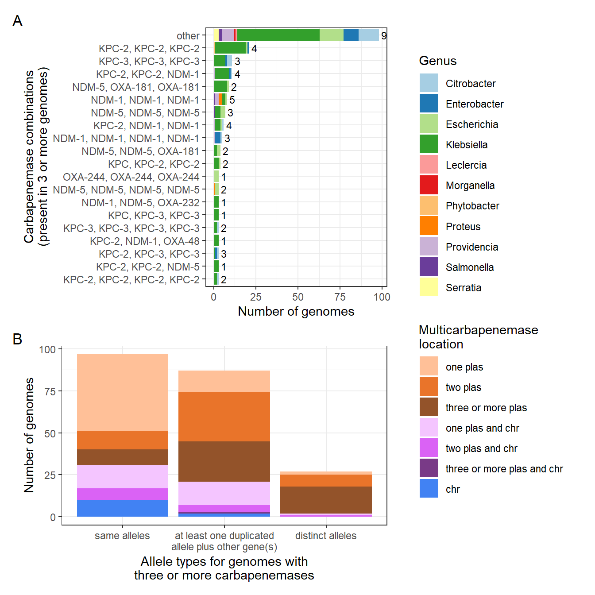{#fig-plot-s6 width=672}
:::
:::


### Supplementary Figure 7: Proportion of AMR-encoding plasmids that encoded at least one resistance gene to different antibiotic gene classes


::: {.cell}

```{.r .cell-code}
multicarb_plas_list <- gene |> 
  filter(location == "plasmid")  |> 
  count(contig_id) |> 
  filter(n > 1) |> 
  pull(contig_id)

singlecarb_plas_list <- gene |> 
  filter(location == "plasmid")  |> 
  count(contig_id) |> 
  filter(n == 1) |> 
  pull(contig_id)

amr_nocarbs <- amr |> 
  filter(!str_detect(gene, "blaNDM|blaKPC|blaOXA-48|blaOXA-181|blaOXA-232|blaOXA-244|blaOXA-204|blaOXA-1205|blaOXA-1207|blaVIM|blaIMP") & !str_detect(closest_reference, "OXA-48|OXA-181|OXA-232|OXA-244|OXA-204|OXA-1205|OXA-1207")) 

multicarb_plas_amr1 <- gene |> 
  filter(location == "plasmid") |> 
  mutate(carb_count = ifelse(contig_id %in% multicarb_plas_list, "Two or more", ifelse(contig_id %in% singlecarb_plas_list, "One", "None"))) |> 
  group_by(carb_count, contig_id) |> 
  arrange(gene) |> 
  summarize(carb = toString(gene, sep = ", ")) |> 
  mutate(carb_group = case_when(
    str_detect(carb, "IMP") & str_detect(carb, "KPC") & str_detect(carb, "NDM") ~ "IMP, KPC, NDM",
    str_detect(carb, "IMP") & str_detect(carb, "KPC") & str_detect(carb, "OXA") ~ "IMP, KPC, OXA",
    str_detect(carb, "IMP") & str_detect(carb, "KPC") & str_detect(carb, "VIM") ~ "IMP, KPC, VIM",
    str_detect(carb, "IMP") & str_detect(carb, "NDM") & str_detect(carb, "OXA") ~ "IMP, NDM, OXA",
    str_detect(carb, "IMP") & str_detect(carb, "NDM") & str_detect(carb, "VIM") ~ "IMP, NDM, VIM",
    str_detect(carb, "IMP") & str_detect(carb, "OXA") & str_detect(carb, "VIM") ~ "IMP, OXA, VIM",
    str_detect(carb, "KPC") & str_detect(carb, "NDM") & str_detect(carb, "OXA") ~ "KPC, NDM, OXA",
    str_detect(carb, "KPC") & str_detect(carb, "NDM") & str_detect(carb, "VIM") ~ "KPC, NDM, VIM",
    str_detect(carb, "KPC") & str_detect(carb, "OXA") & str_detect(carb, "VIM") ~ "KPC, OXA, VIM",
    str_detect(carb, "NDM") & str_detect(carb, "OXA") & str_detect(carb, "VIM") ~ "NDM, OXA, VIM",
    str_detect(carb, "IMP") & str_detect(carb, "OXA") ~ "IMP, OXA",
    str_detect(carb, "IMP") & str_detect(carb, "NDM") ~ "IMP, NDM",
    str_detect(carb, "IMP") & str_detect(carb, "VIM") ~ "IMP, VIM",
    str_detect(carb, "IMP") & str_detect(carb, "KPC") ~ "IMP, KPC",
    str_detect(carb, "KPC") & str_detect(carb, "NDM") ~ "KPC, NDM",
    str_detect(carb, "KPC") & str_detect(carb, "OXA") ~ "KPC, OXA",
    str_detect(carb, "KPC") & str_detect(carb, "VIM") ~ "KPC, VIM",
    str_detect(carb, "NDM") & str_detect(carb, "OXA") ~ "NDM, OXA",
    str_detect(carb, "NDM") & str_detect(carb, "VIM") ~ "NDM, VIM",
    str_detect(carb, "OXA") & str_detect(carb, "VIM") ~ "OXA, VIM",
    str_detect(carb, "NDM") ~ "NDM",
    str_detect(carb, "OXA") ~ "OXA",
    str_detect(carb, "KPC") ~ "KPC",
    str_detect(carb, "IMP") ~ "IMP",
    str_detect(carb, "VIM") ~ "VIM",
    str_detect(carb, "IMI") ~ "IMI",
    TRUE ~ NA
  )) |> 
  mutate(carb_group = ifelse(carb_group != "NDM, OXA" & carb_group != "KPC, NDM" & carb_group != "KPC" & carb_group != "NDM" & carb_group != "OXA" & carb_count == "Two or more", "other", carb_group)) 

nocarb_plas_amr <- contigs |> 
  filter(carb == "no" & location == "plasmid") |> 
  select(carb_count = carb, contig_id) |> 
  mutate(carb = NA, carb_group = "None", carb_count = "None")   

multicarb_plas_amr2 <- rbind(multicarb_plas_amr1, nocarb_plas_amr) |> 
  left_join((amr_nocarbs |> select(contig_id, accession, gene, subclass)), by = c("contig_id")) |> 
  separate_longer_delim(subclass, delim = "/") |> 
  filter(!(carb_count == "None" & is.na(gene))) |> 
  select(!gene) |> 
  distinct() |> 
  pivot_wider(id_cols = c("contig_id", "carb_count", "carb", "carb_group", "accession"), names_from = subclass, values_from = subclass, values_fn = ~1, values_fill = 0) |> 
  pivot_longer(cols = !c("contig_id", "carb_count",  "carb", "carb_group", "accession"), names_to = "antibiotic", values_to = "n") |> 
  filter(antibiotic != "NA") 

num_zero_carb_plas <- multicarb_plas_amr2 |> 
  distinct(contig_id, carb_count)  |> 
  count(carb_count) |> 
  filter(carb_count == "None") |> 
  pull(n)

amr_heatmap <- multicarb_plas_amr2 |> 
  group_by(carb_count, carb_group, antibiotic) |>
  summarize(sum = sum(n)) |> 
  left_join((multicarb_plas_amr1  |> count(carb_count, carb_group, name = "total_plas")), by = c("carb_group", "carb_count")) |> 
  mutate(total_plas = ifelse(carb_count == "None", num_zero_carb_plas, total_plas)) |> 
  mutate(prop = sum/total_plas) |> 
  mutate(carb_group = str_replace(carb_group, "OXA", "OXA-48-like")) |> 
  mutate(label = paste0(carb_group, "\n(n=", total_plas, ")" )) |> 
  ggplot(aes(x = label, y = antibiotic)) +
   geom_tile(aes(fill = prop)) +
  geom_text(aes(label = round(prop, digits=2)), color="white", size=3) +
   theme_bw() +
   theme(axis.text.x = element_text(angle = 90, vjust = 0.5, hjust = 0.95)) +
  facet_wrap(~ carb_count, scales = "free_x", space = "free_x") +
  scale_fill_gradient(low="#264040",high="cadetblue3") +
  labs(x = "Carbapenemase group", y = "Antibiotic class", fill = "Proportion\nof plasmids\nencoding\nat least\none gene");amr_heatmap
```

::: {.cell-output-display}
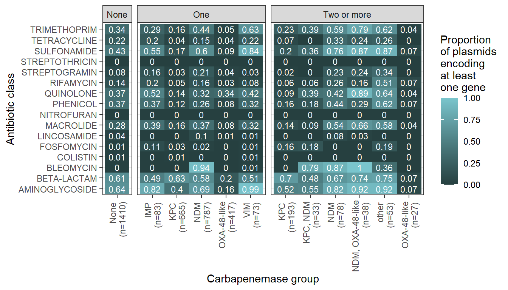{#fig-plot-s7 width=672}
:::
:::


### Supplementary Figure 8: Carbapenemase groups and genera represented in the top 8 carbapenemase plasmid secondary clusters


::: {.cell}

```{.r .cell-code}
gene_carb_group <- gene |> 
  filter(location == "plasmid") |> 
  filter(str_detect(secondary_cluster, "AH615|AH539|AL194|AH594|AJ272|AH561|AI283|AI436")) |> 
  group_by(contig_id, organism, primary_cluster, secondary_cluster) |> 
  arrange(gene) |> 
  summarize(carb = toString(gene, sep =", ")) |> 
  ungroup() |> 
  mutate(carb_group = case_when(
    str_detect(carb, "IMP") & str_detect(carb, "KPC") & str_detect(carb, "NDM") ~ "IMP, KPC, NDM",
    str_detect(carb, "IMP") & str_detect(carb, "KPC") & str_detect(carb, "OXA") ~ "IMP, KPC, OXA",
    str_detect(carb, "IMP") & str_detect(carb, "KPC") & str_detect(carb, "VIM") ~ "IMP, KPC, VIM",
    str_detect(carb, "IMP") & str_detect(carb, "NDM") & str_detect(carb, "OXA") ~ "IMP, NDM, OXA",
    str_detect(carb, "IMP") & str_detect(carb, "NDM") & str_detect(carb, "VIM") ~ "IMP, NDM, VIM",
    str_detect(carb, "IMP") & str_detect(carb, "OXA") & str_detect(carb, "VIM") ~ "IMP, OXA, VIM",
    str_detect(carb, "KPC") & str_detect(carb, "NDM") & str_detect(carb, "OXA") ~ "KPC, NDM, OXA",
    str_detect(carb, "KPC") & str_detect(carb, "NDM") & str_detect(carb, "VIM") ~ "KPC, NDM, VIM",
    str_detect(carb, "KPC") & str_detect(carb, "OXA") & str_detect(carb, "VIM") ~ "KPC, OXA, VIM",
    str_detect(carb, "NDM") & str_detect(carb, "OXA") & str_detect(carb, "VIM") ~ "NDM, OXA, VIM",
    str_detect(carb, "IMP") & str_detect(carb, "OXA") ~ "IMP, OXA",
    str_detect(carb, "IMP") & str_detect(carb, "NDM") ~ "IMP, NDM",
    str_detect(carb, "IMP") & str_detect(carb, "VIM") ~ "IMP, VIM",
    str_detect(carb, "IMP") & str_detect(carb, "KPC") ~ "IMP, KPC",
    str_detect(carb, "KPC") & str_detect(carb, "NDM") ~ "KPC, NDM",
    str_detect(carb, "KPC") & str_detect(carb, "OXA") ~ "KPC, OXA",
    str_detect(carb, "KPC") & str_detect(carb, "VIM") ~ "KPC, VIM",
    str_detect(carb, "NDM") & str_detect(carb, "OXA") ~ "NDM, OXA",
    str_detect(carb, "NDM") & str_detect(carb, "VIM") ~ "NDM, VIM",
    str_detect(carb, "OXA") & str_detect(carb, "VIM") ~ "OXA, VIM",
    str_detect(carb, "NDM") ~ "NDM",
    str_detect(carb, "OXA") ~ "OXA",
    str_detect(carb, "KPC") ~ "KPC",
    str_detect(carb, "IMP") ~ "IMP",
    str_detect(carb, "VIM") ~ "VIM",
    str_detect(carb, "IMI") ~ "IMI",
    TRUE ~ NA
  ))
  
cluster_a <- gene_carb_group |> 
  mutate(carb_group_plotting = carb_group ) |> 
  mutate(carb_group_plotting = factor(carb_group_plotting, levels = c("IMP", "IMP, KPC", "IMP, VIM", "KPC", "KPC, NDM", "KPC, VIM", "NDM", "NDM, OXA", "OXA", "VIM"))) |>     
  group_by(primary_cluster, secondary_cluster, carb_group_plotting)  |> 
  count() |> 
  mutate(cluster = paste0(primary_cluster, "/\n", secondary_cluster)) |> 
  mutate(carb_group_plotting = str_replace(carb_group_plotting, "OXA", "OXA-48-like")) |> 
  ggplot(aes(x = cluster, y = n, fill = carb_group_plotting)) +
  geom_bar_pattern(stat="identity", position = "stack", aes(pattern_fill = carb_group_plotting), pattern_colour = NA, pattern_density = 0.5, pattern_spacing = 0.02) + 
  theme_bw() +
  theme(axis.text.x = element_text(size = 7, angle=90, vjust = 0.5)) +
  scale_fill_manual(values = c("#D55E00", "#D55E00", "#56B4E9", "#56B4E9", "#56B4E9", "#E69F00", "#E69F00", "#CC79A7", "#0072B2")) +
  scale_pattern_fill_manual(values = c("#56B4E9", "#0072B2", "#56B4E9", "#E69F00", "#0072B2", "#E69F00", "#CC79A7", "#CC79A7", "#0072B2")) +
  labs(fill = "Carbapenemase\ngroup", y = "Number of\nplasmids", x = "Plasmid cluster", pattern_fill = "Carbapenemase\ngroup")

cluster_b <- gene_carb_group |> 
  mutate(genus = str_remove(organism, " .*")) |> 
  group_by(primary_cluster, secondary_cluster, genus)  |> 
  count() |> 
  mutate(cluster = paste0(primary_cluster, "/\n", secondary_cluster)) |> 
  ggplot(aes(x = cluster, y = n, fill = genus)) +
  geom_bar(stat="identity", position="stack") +
  theme_bw() +
  theme(axis.text.x = element_text(size = 7, angle=90, vjust = 0.5)) +
  scale_fill_manual(values = c("#A6CEE3", "#1F78B4", "#B2DF8A", "#33A02C", "#FDBF6F", "#CAB2D6", "#6A3D9A")) +
  labs(fill = "Genus", y = "Number of\nplasmids", x = "Plasmid cluster")
  
cluster_a + cluster_b + plot_layout(nrow = 2) + plot_annotation(tag_level ="A") & theme(legend.justification = "left")
```

::: {.cell-output-display}
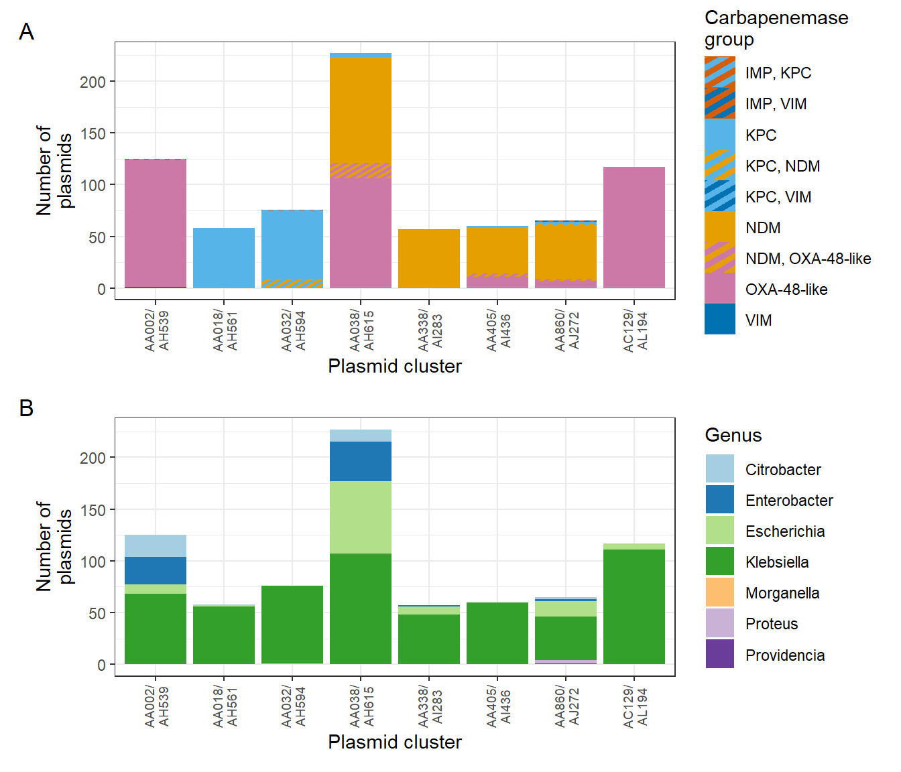{#fig-plot-s8 width=672}
:::
:::


### Supplementary Figure 9: Hypervirulent *K. pneumoniae*


::: {.cell}

```{.r .cell-code}
hvkp_meta <- hvkp |> 
  ungroup() |> 
  distinct(accession) |> 
  left_join(meta |> select(accession, mlst, year, country, continent, isolation_source_group, carb, carb_group, carb_count, multicarb_location, multicarb_type)) 

hvkp_combos <- hvkp_meta |> 
  group_by(carb_group) |> 
  count(carb) |> 
  mutate(carb = ifelse(n == 1, "other", carb)) |> 
  group_by(carb_group, carb) |> 
  mutate(carb = str_remove_all(carb, "bla")) |> 
  mutate(carb = case_when(
    carb == "OXA, OXA" ~ "OXA novel, OXA novel", 
    carb == "KPC, KPC-2" ~ "KPC novel, KPC-2", 
    carb == "OXA, OXA-232" ~ "OXA novel, OXA-232", 
    carb == "KPC, KPC-2, KPC-2, KPC-25" ~ "KPC novel, KPC-2, KPC-2, KPC-25", 
    TRUE ~ carb)) |> 
  summarize(nn = sum(n)) |> 
  mutate(carb_group = str_replace(carb_group, "OXA", "OXA-48-like")) |> 
  ggplot(aes(x=nn, y = reorder(carb,nn, FUN = "sum"), fill = carb_group)) +
  geom_bar_pattern(stat="identity", position = "stack", aes(pattern_fill = carb_group), pattern_colour = NA, pattern_density = 0.5, pattern_spacing = 0.02) + 
  theme_bw() +
  scale_fill_manual(values = c("#D55E00", "#D55E00", "#56B4E9", "#56B4E9", "#56B4E9", "#56B4E9","#56B4E9","#E69F00", "#E69F00", "#CC79A7")) +
  scale_pattern_fill_manual(values = c("#56B4E9", "#E69F00", "#56B4E9", "#E69F00", "grey30","#CC79A7","#0072B2", "#E69F00", "#CC79A7", "#CC79A7")) +
  labs(fill = "Carbapenemase\ngroup", y = "Carbapenemase combinations\n(present in 2 or more genomes)", x = "Number of genomes", pattern_fill = "Carbapenemase\ngroup")

hvkp_plas <- hvkp |> 
  left_join(contigs |> select(contig_id, secondary_cluster, length, location), by = "contig_id") |> 
  filter(location == "plasmid") |> 
  mutate(carb = ifelse(contig_id %in% (gene |> distinct(contig_id) |> pull()), "yes", "no")) |> 
  ungroup() 

multicarb_location_hvkp <- gene |> 
  filter(accession %in% (hvkp_meta |> pull(accession))) |> 
  mutate(genomic_location = ifelse(location == "plasmid" & contig_id %in% (hvkp_plas |> distinct(contig_id) |> pull(contig_id)), "virplasmid", location)) |> 
  mutate(contig_location = paste(contig_id, genomic_location, sep = "_")) |> 
  group_by(accession, contig_location) |> 
  summarize(gene= toString(gene, sep= ", ")) |> 
  summarize(contig_location = toString(contig_location, sep = ", ")) |> 
  mutate(multicarb_location = case_when(
    str_detect(contig_location, "_plasmid, .*_plasmid.*_plasmid") & str_detect(contig_location, "chromosome") ~ "three or more non-vir plas and chr",
    str_detect(contig_location, "_plasmid, .*_plasmid") & str_detect(contig_location, "chromosome") ~ "two non-vir plas and chr",
    str_detect(contig_location, "_virplasmid, .*plasmid") & str_detect(contig_location, "chromosome") ~ "vir plas, non-vir plas, and chr",
    str_detect(contig_location, "_plasmid") & str_detect(contig_location, "chromosome") ~ "non-vir plas and chr",
    str_detect(contig_location, "_virplasmid") & str_detect(contig_location, "chromosome") ~ "vir plas and chr",
    str_detect(contig_location, "_plasmid, .*_plasmid, .*_plasmid") ~ "three or more non-vir plas",
    str_detect(contig_location, "_virplasmid, .*_plasmid, .*_plasmid") ~ "vir plas and two or more non-vir plas",
    str_detect(contig_location, "_plasmid, .*_virplasmid, .*_plasmid") ~ "vir plas and two or more non-vir plas",
    str_detect(contig_location, "_plasmid, .*_plasmid, .*_virplasmid") ~ "vir plas and two or more non-vir plas",
    str_detect(contig_location, "_plasmid, .*_plasmid") ~ "two non-vir plas",
    str_detect(contig_location, "_virplasmid") & str_detect(contig_location, "_plasmid") ~ "vir plas and non-vir plas",
    str_detect(contig_location, "chromosome")  ~ "chr",
    str_detect(contig_location, "_plasmid") ~ "non-vir plas",
    str_detect(contig_location, "_virplasmid") ~ "vir plas",
    TRUE ~ NA  
  )) |> 
  select(!contig_location)

hvkp_location <- hvkp_meta |> 
  left_join(multicarb_location_hvkp, by = "accession") |> 
  mutate(multicarb_location.y = factor(multicarb_location.y, levels = c("non-vir plas", "vir plas",  "two non-vir plas", "vir plas and non-vir plas",  "three or more non-vir plas", "vir plas and two or more non-vir plas",  "non-vir plas and chr", "vir plas and chr",  "two non-vir plas and chr", "vir plas, non-vir plas, and chr", "three or more non-vir plas and chr", "chr"))) |> 
  mutate(multicarb_type = ifelse(multicarb_type == "same alleles", "same\nalleles", ifelse(multicarb_type == "different alleles", "different\nalleles", "different\nfamilies"))) |> 
  mutate(multicarb_type = factor(multicarb_type, levels = c("same\nalleles", "different\nalleles", "different\nfamilies"))) |> 
  ggplot(aes(x = multicarb_type, fill = multicarb_location.y)) + 
  geom_bar_pattern(stat="count", position = "stack", aes(pattern_fill = multicarb_location.y), pattern_colour = NA, pattern_density = 0.5, pattern_spacing = 0.02) + 
  theme_bw() +
  scale_fill_manual(values = c("#ffc098" , "#ffc098", "#e9742a", "#e9742a", "#93532a", "#93532a", "#f4c5ff" , "#f4c5ff", "#da62f5", "#da62f5", "#793a87", "#4182f3")) +
  scale_pattern_fill_manual(values = c("#ffc098" , "grey30", "#e9742a", "grey30", "#93532a", "grey30", "#f4c5ff" , "grey30", "#da62f5", "grey30", "#793a87", "#4182f3")) +
  labs(y = "Number of genomes", x = "Multi-carbapenemase type", fill = "Multi-carbapenemase\nlocation", pattern_fill = "Multi-carbapenemase\nlocation")

hvkp_combos + free(hvkp_location, side="l") + plot_layout(design = "A\nB", heights =c(0.65, 0.4)) + plot_annotation(tag_levels = "A") & theme(legend.justification = "left")
```

::: {.cell-output-display}
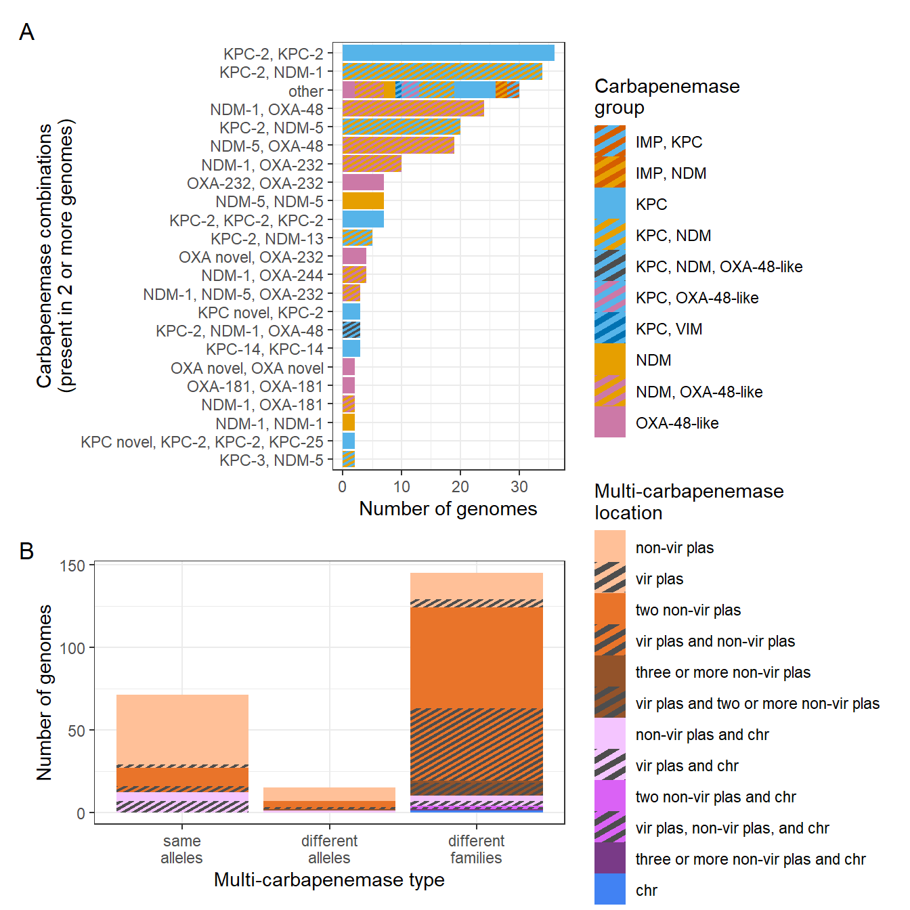{#fig-plot-s9 width=672}
:::
:::


### Supplementary Figure 10: Carbapenemases with non-exact allele matches 


::: {.cell}

```{.r .cell-code}
mismatches2 <- amr |> 
  filter(accession %in% (meta |> pull(accession))) |> 
  filter(str_detect(gene, "blaNDM|blaKPC|blaOXA-48|blaOXA-181|blaOXA-232|blaOXA-244|blaOXA-204|blaOXA-1205|blaOXA-1207|blaVIM|blaIMP") | str_detect(closest_reference, "OXA-48|OXA-181|OXA-232|OXA-244|OXA-204|OXA-1205|OXA-1207")) |> 
  filter(status != "ALLELEX" & status != "PARTIAL_CONTIG_ENDX") |> 
  left_join(meta_raw |> select(accession, multicarb_type, multicarb_location, carb), by = "accession") |> 
  filter(!is.na(multicarb_type)) |> 
  mutate(multicarb_type = ifelse(multicarb_type == "different types", "different families", "same family")) |> 
  group_by(gene, status) |> 
  count(multicarb_type)

mismatches_plt <- mismatches2 |> 
  mutate(multicarb_type = factor(multicarb_type, levels = c("same family", "different families"))) |> 
  mutate(status = case_when(
    status == "BLASTX" ~ "different protein",
    status == "PARTIALX" ~ "pseudogene/frameshift",
    status == "INTERNAL_STOP" ~ "internal stop",
    #status == "PARTIAL_CONTIG_ENDX" ~ "split on contig end",
    TRUE ~ NA)) |> 
  ggplot(aes(x = multicarb_type, fill = status, y = n)) +
  geom_bar(stat = "identity") +
  theme_bw() +
  scale_fill_manual(values = c("cadetblue2", "cadetblue3", "cadetblue4")) +
  labs(x = "Carbapenemases in genome", y = "Mutant carbapenemase\n(non-exact allele matches)\ncount", fill = "Gene status") +
  theme(axis.text.x = element_text(angle=90)) +
  facet_wrap(~ factor(gene, labels = c("IMP\n(n=1)", "KPC\n(n=75)", "NDM\n(n=46)", "OXA-48-\nlike\n(n=22)", "VIM\n(n=3)")), nrow=1);mismatches_plt
```

::: {.cell-output-display}
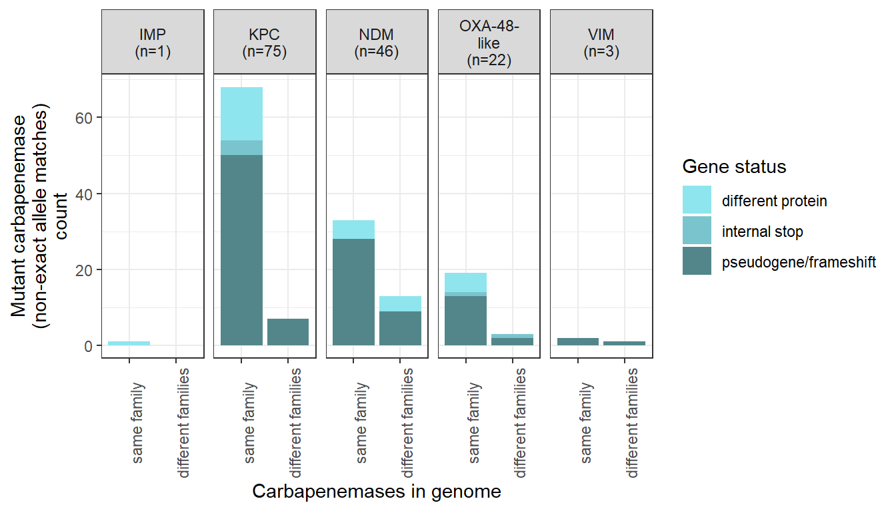{#fig-plot-s10 width=672}
:::
:::


### Supplementary Figure 11: Proportion of genomes with different multi-carbapenemase groups over time


::: {.cell}

```{.r .cell-code}
year <- meta |> 
  mutate(carb_group_plotting = case_when(
    str_count(carb_group, ",") > 1 ~ "other",
    carb_group == "NDM, VIM" ~ "other",
    carb_group == "IMP, OXA" ~ "other",
    carb_group == "IMP, VIM" ~ "other",
    TRUE ~ carb_group )) |> 
  mutate(carb_group_plotting = factor(carb_group_plotting, levels = c("IMP", "IMP, KPC", "IMP, NDM", "KPC", "KPC, NDM", "KPC, OXA", "KPC, VIM", "NDM", "NDM, OXA", "OXA", "OXA, VIM", "VIM", "other"))) |>  
  group_by(year) |> 
  count(carb_group_plotting) |> 
  left_join(meta |> count(year, name = "year_total"), by = "year") |> 
  mutate(carb_group_plotting = str_replace(carb_group_plotting, "OXA", "OXA-48-like")) |> 
  mutate(prop = n/year_total) |> 
  ggplot(aes(x = year, y = prop, fill = carb_group_plotting)) +
  geom_bar_pattern(stat="identity", position = "stack", aes(pattern_fill = carb_group_plotting), pattern_colour = NA, pattern_density = 0.5, pattern_spacing = 0.02) + 
  theme_bw() +
  theme(axis.text.x = element_text(angle = 90)) +
  labs(x = "Year", fill = "Carbapenemase\ngroup", y = "Proportion", pattern_fill = "Carbapenemase\ngroup") +
  scale_fill_manual(values = c("#D55E00", "#D55E00", "#D55E00", "#56B4E9", "#56B4E9", "#56B4E9", "#56B4E9", "#E69F00", "#E69F00", "#CC79A7", "#CC79A7", "#0072B2", "grey")) +
  scale_pattern_fill_manual(values = c("#D55E00", "#56B4E9", "#E69F00", "#56B4E9", "#E69F00","#CC79A7", "#0072B2", "#E69F00", "#CC79A7", "#CC79A7", "#0072B2","#0072B2", "grey"));year
```

::: {.cell-output-display}
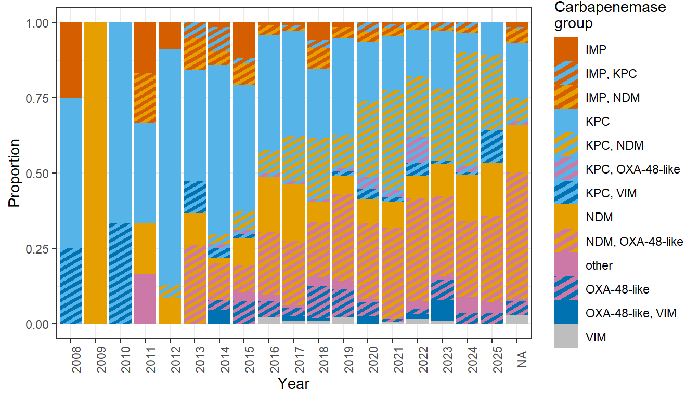{#fig-plot-s11 width=672}
:::
:::


### Supplementary Figure 12: Multi-carbapenemase Enterobacterales genomes from NCBI GenBank with fewer than 40 contigs ordered by number of contigs (n=2033)


::: {.cell}

```{.r .cell-code}
ncbi_multicarb_accessions <- carbs_ncbi |> 
  count(accession)  |> 
  filter(n > 1) |> 
  pull(accession)

meta_below40 <- meta_ncbi |> 
  filter(accession %in% ncbi_multicarb_accessions) |> 
  mutate(long_read_platform = ifelse(str_detect(platform, "Oxford|Nanopore|nanopore|OXFORD|pacbio|PacBio|Pacbio|PacBIO|Pacific Bio|GridION|MinION|minION|Hybrid|ONT") & !is.na(platform), "yes", "no")) 

p1 <- meta_below40 |> 
  ggplot(aes(y = assembly_num_contigs, x = reorder(accession, assembly_num_contigs))) +
  geom_point() +
  theme_bw() +
  theme(panel.grid.major.x = element_blank()) +
  geom_hline(yintercept = 20) +
  labs(x = "Genomes", y = "Number of contigs") +
  theme(axis.text.x = element_blank(), axis.ticks.x = element_blank())

p2 <- meta_below40 |> 
  ggplot(aes(x = assembly_num_contigs, fill = long_read_platform)) +
  geom_vline(xintercept = 20) +
  geom_bar(stat = "count") +
  labs(x = "Number of contigs", y = "Number of genomes", fill = "Sequenced with\nlong read platform?") +
  scale_fill_manual(values = c("grey70","grey30")) +
  theme_bw()

p1 + p2 + plot_annotation(tag_levels = 'A')
```

::: {.cell-output-display}
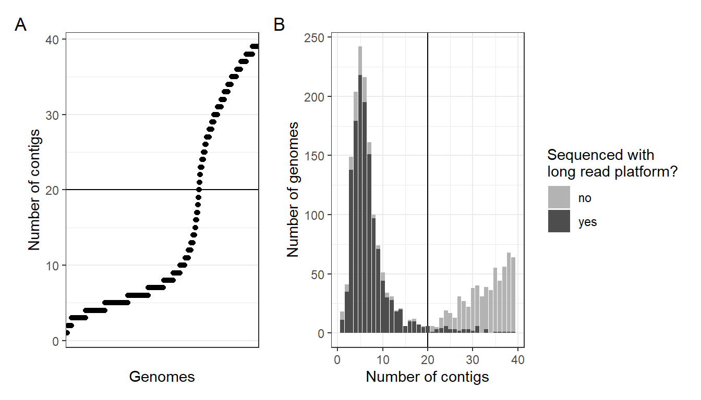{#fig-plot-s12 width=672}
:::
:::


# Statistical analyses

### Pearson's Chi-squared: carbapenemase combinations vs genus


::: {.cell}

```{.r .cell-code}
meta_carb <- meta  |> 
  #filter(dereplicate == "unique") |> 
  mutate(carb = ifelse(carb %in% (meta |> filter(dereplicate == "unique") |> count(carb) |> filter(n > 9) |> pull(carb)), carb, "other")) |> 
  count(carb, genus)  |> 
  ungroup() |> 
  arrange(desc(n))  

meta_carb2 <- meta_carb |> 
  mutate(genus = factor(genus)) |> 
  pivot_wider(id_cols = genus, names_from = carb, values_from = n, values_fill = 0) |> 
  column_to_rownames("genus")
sim_test <- chisq.test(meta_carb2, simulate.p.value=TRUE, B=20000);sim_test
```

::: {.cell-output .cell-output-stdout}

```

	Pearson's Chi-squared test with simulated p-value (based on 20000
	replicates)

data:  meta_carb2
X-squared = 863.9, df = NA, p-value = 5e-05
```


:::

```{.r .cell-code}
residuals_table <- sim_test$stdres
raw_p_values <- 2 * (1 - pnorm(abs(residuals_table)))

# Apply Benjamini-Hochberg (BH/FDR) adjustment across all 300 cells
adjusted_p_values <- p.adjust(raw_p_values, method = "BH")

# Re-shape the adjusted p-values back into the original 12x25 matrix structure
adj_p_matrix <- matrix(adjusted_p_values, nrow = 12, ncol = 25, 
                       dimnames = list(rownames(meta_carb2), colnames(meta_carb2)))

# Find cells where the BH-adjusted p-value is less than 0.05
significant_indices <- which(adj_p_matrix < 0.05, arr.ind = TRUE)

# Display the significant drivers
if(nrow(significant_indices) > 0) {
  results_summary <- data.frame(
    Row = rownames(adj_p_matrix)[significant_indices[, 1]],
    Column = colnames(adj_p_matrix)[significant_indices[, 2]],
    Residual = residuals_table[significant_indices],
    BH_Adj_P = adj_p_matrix[significant_indices]
  )
  print("--- SIGNIFICANT DRIVING CELLS FOUND (BH ADJ) ---")
  print(results_summary[order(results_summary$BH_Adj_P), ]) # Ordered by significance
} else {
  print("No cells were significant after Benjamini-Hochberg adjustment.")
}
```

::: {.cell-output .cell-output-stdout}

```
[1] "--- SIGNIFICANT DRIVING CELLS FOUND (BH ADJ) ---"
            Row                       Column  Residual     BH_Adj_P
11     Serratia           blaKPC-3, blaKPC-3  8.852955 0.000000e+00
13  Escherichia         blaNDM-5, blaOXA-181 14.858226 0.000000e+00
21  Phytobacter blaKPC-2, blaKPC-2, blaKPC-2  8.397808 0.000000e+00
24      Proteus           blaNDM-1, blaNDM-1 10.310442 0.000000e+00
20  Escherichia           blaNDM-5, blaNDM-5  7.298441 1.746603e-11
12   Klebsiella         blaNDM-5, blaOXA-181 -6.825704 4.374723e-10
1    Klebsiella                        other -6.619002 1.549846e-09
18 Enterobacter          blaNDM-5, blaOXA-48  5.401701 2.475447e-06
14   Klebsiella         blaNDM-1, blaOXA-232  4.784578 5.711578e-05
22   Klebsiella           blaNDM-1, blaNDM-1 -4.712464 7.342171e-05
15   Klebsiella         blaNDM-5, blaOXA-232  4.180922 7.918089e-04
16   Klebsiella           blaKPC-2, blaNDM-5  4.110054 9.889159e-04
23  Providencia           blaNDM-1, blaNDM-1  3.984003 1.563787e-03
4    Klebsiella           blaKPC-2, blaNDM-1  3.964651 1.575075e-03
2  Enterobacter                        other  3.898942 1.932281e-03
5   Escherichia           blaKPC-2, blaNDM-1 -3.756452 3.231364e-03
19   Klebsiella           blaNDM-5, blaNDM-5 -3.657458 4.495210e-03
6    Klebsiella           blaKPC-2, blaKPC-2  3.593687 5.147870e-03
25 Enterobacter           blaIMP-4, blaNDM-1  3.602906 5.147870e-03
10  Escherichia           blaKPC-3, blaKPC-3 -3.211866 1.978138e-02
17   Klebsiella         blaNDM-4, blaOXA-181  3.066867 3.090214e-02
8    Klebsiella          blaNDM-1, blaOXA-48  2.990896 3.664513e-02
9   Escherichia          blaNDM-1, blaOXA-48 -2.987852 3.664513e-02
7      Kluyvera           blaKPC-2, blaKPC-2  2.947823 4.000253e-02
27  Citrobacter          blaOXA-48, blaVIM-1  2.919736 4.203931e-02
26  Providencia           blaIMP-4, blaNDM-1  2.887440 4.481436e-02
3   Providencia                        other  2.873766 4.506771e-02
```


:::
:::


### Fisher's exact test: genomic location


::: {.cell}

```{.r .cell-code}
test <- meta |> 
  count(multicarb_type, multicarb_location) |> 
  pivot_wider(id_cols = multicarb_type, names_from = multicarb_location, values_from = n, values_fill = 0) |> 
  column_to_rownames("multicarb_type")
 
fisher.test(test, simulate.p.value = TRUE, B=20000)
```

::: {.cell-output .cell-output-stdout}

```

	Fisher's Exact Test for Count Data with simulated p-value (based on
	20000 replicates)

data:  test
p-value = 5e-05
alternative hypothesis: two.sided
```


:::

```{.r .cell-code}
chisq.test(test, simulate.p.value = TRUE, B=20000)$stdres
```

::: {.cell-output .cell-output-stdout}

```
                          chr three or more plas two plas and chr   two plas
same alleles       7.44963315          -2.646551         1.598346 -14.663180
different alleles -0.05433621           2.401024         1.218363  -4.264476
different types   -7.19076319           1.292843        -2.194422  16.469455
                  one plas and chr   one plas three or more plas and chr
same alleles              4.501520  11.402717                 -0.7542029
different alleles        -1.206782   4.553456                 -0.2840551
different types          -3.723183 -13.462782                  0.8813903
```


:::
:::


### Firth's penalised binary logistic regression: consolidation of carbapenemases onto a single plasmid backbone


::: {.cell}

```{.r .cell-code}
location_stats <- meta |> 
  #filter(dereplicate == "unique") |> 
  filter(!is.na(year)) |> 
  mutate(year = as.numeric(year)) |> 
  mutate(multicarb_location = droplevels(as.factor(multicarb_location))) |> 
  mutate(multicarb_location = relevel(multicarb_location, ref = "two plas"))

# Create the binary outcome variable 
location_stats$target_binary <- ifelse(
  location_stats$multicarb_location == "one plas", 1, 0
)

# Center the year variable (starts at 1 instead of calendar year) - this brings the intercept down from the billions to a normal scale
location_stats$year_centered <- location_stats$year - min(location_stats$year) + 1

# Run Firth's Penalized Binary Logistic Regression
binary_firth_model <- logistf(
  target_binary ~ year_centered, 
  data = location_stats
)

summary(binary_firth_model)
```

::: {.cell-output .cell-output-stdout}

```
logistf(formula = target_binary ~ year_centered, data = location_stats)

Model fitted by Penalized ML
Coefficients:
                     coef   se(coef)  lower 0.95  upper 0.95     Chisq
(Intercept)   -1.39777142 0.24545845 -1.88661115 -0.92320891 34.908981
year_centered  0.02042947 0.01885209 -0.01628982  0.05769588  1.182485
                         p method
(Intercept)   3.454835e-09      2
year_centered 2.768506e-01      2

Method: 1-Wald, 2-Profile penalized log-likelihood, 3-None

Likelihood ratio test=1.182485 on 1 df, p=0.2768506, n=1366
Wald test = 327.3968 on 1 df, p = 0
```


:::

```{.r .cell-code}
# Extract the raw log-odds coefficients and profile confidence intervals
log_odds_coef <- coef(binary_firth_model)
log_odds_ci   <- confint(binary_firth_model)

# Convert them to the odds ratio scale 
odds_ratios <- exp(log_odds_coef)
ci_exponentiated <- exp(log_odds_ci)

# print results
results_table <- cbind(OR = odds_ratios, 
                       Lower_95_CI = ci_exponentiated[,1], 
                       Upper_95_CI = ci_exponentiated[,2])

print(results_table["year_centered", , drop = FALSE])
```

::: {.cell-output .cell-output-stdout}

```
                   OR Lower_95_CI Upper_95_CI
year_centered 1.02064   0.9838421    1.059393
```


:::
:::


### Permutation test: pairwise carbapenemase co-occurence


::: {.cell}

```{.r .cell-code}
transactions <- meta |> 
  #filter(dereplicate == "unique") |> 
  filter(accession != "GCA_023982975.1") |> # has multiple VIM-63 copies that are skewing results, only isolate with this gene
  mutate(transaction_id = 1:n()) |>
  separate_longer_delim(carb, delim = ", ") |> 
  select(transaction_id, item=carb)

df <- transactions |> 
  mutate(transaction_id = as.factor(transaction_id), item = as.factor(item))

transactions <- levels(df$transaction_id)
items <- levels(df$item)

n_transactions <- length(transactions)
n_items <- length(items)

# Integer indices
transaction_idx <- as.integer(df$transaction_id)
item_idx <- as.integer(df$item)

# spare transaction x item matrix
X <- Matrix::sparseMatrix(
  i = transaction_idx,
  j = item_idx,
  x = 1,
  dims = c(n_transactions, n_items),
  dimnames = list(transactions, items)
)

# function to calculate pair counts
get_pairs_matrix <- function(X) {

  # Cross-products
  cp <- as.matrix(crossprod(X))

  # Self-pairs: choose(count, 2)
  self_counts <- colSums(X * (X - 1) / 2)

  # Replace diagonal of crossprod with correct self-pair counts
  diag(cp) <- self_counts

  cp
}

# calculate observed pair count matrix 
observed <- get_pairs_matrix(X)

# permutation function 
permute_once <- function() {

  permuted_items <- sample(item_idx)

  Xperm <- Matrix::sparseMatrix(
    i = transaction_idx,
    j = permuted_items,
    x = 1,
    dims = c(n_transactions, n_items)
  )

  get_pairs_matrix(Xperm)
}

# assign null quantities 
set.seed(123)
B <- 10000
sum_null <- matrix(
  0,
  nrow = n_items,
  ncol = n_items
)
sumsq_null <- matrix(
  0,
  nrow = n_items,
  ncol = n_items
)
n_ge <- matrix(
  0L,
  nrow = n_items,
  ncol = n_items
)

for (b in seq_len(B)) {

  perm <- permute_once()

  # Null expectation
  sum_null <- sum_null + perm

  # For null SD
  sumsq_null <- sumsq_null + perm^2

  # Number of permutations >= observed
  n_ge <- n_ge + (perm >= observed)

  if (b %% 1000 == 0) {
    message("Permutation ", b, " / ", B)
  }
}

# compute null statistic
expected <- sum_null / B

null_variance <- (
  sumsq_null -
    (sum_null^2 / B)
) / (B - 1)

null_sd <- sqrt(
  pmax(null_variance, 0)
)

p_value <- (n_ge + 1) / (B + 1)

# keep only upper triangle 
idx <- which(
  upper.tri(observed, diag = TRUE),
  arr.ind = TRUE
)

results <- data.frame(
  item_1 = items[idx[, 1]],
  item_2 = items[idx[, 2]],
  observed = observed[idx],
  expected = expected[idx],
  null_sd = null_sd[idx],
  p_value = p_value[idx]
)

# add enrichment and multiple-testing correction
results <- results %>%
  mutate(
    enrichment = ifelse(
      expected > 0,
      observed / expected,
      NA_real_),

    log2_enrichment =
      log2(
        (observed + 0.5) /
        (expected + 0.5)),

    q_value = p.adjust(
      p_value,
      method = "BH")
  ) |> 
  arrange(
    q_value,
    desc(enrichment)
  )

# filtering for pairs that appear in more than 5 genomes
significant_pairs <- results |> 
  filter(q_value < 0.05, enrichment > 1, observed >= 5)

results |> 
  filter(observed > 5) |> 
  select(carb1 = item_1, carb2 = item_2, observed, expected, enrichment, log2_enrichment, p_value, q_value) |> 
  arrange(q_value, desc(enrichment))
```

::: {.cell-output .cell-output-stdout}

```
        carb1      carb2 observed expected   enrichment log2_enrichment
1  blaOXA-204 blaOXA-204       10   0.0588 170.06802721      4.23191350
2    blaKPC-4   blaKPC-4        7   0.0775  90.32258065      3.69899774
3    blaIMP-1   blaIMP-1       25   0.3292  75.94167679      4.94263332
4  blaOXA-244 blaOXA-244       18   0.2763  65.14657980      4.57476717
5      blaNDM     blaNDM        9   0.4357  20.65641496      3.34380955
6      blaKPC     blaKPC       17   1.2238  13.89115869      3.34369062
7    blaVIM-1   blaVIM-1       20   1.5525  12.88244767      3.32016978
8    blaIMP-4   blaIMP-4       12   1.1373  10.55130572      2.93253750
9    blaNDM-4 blaOXA-181       27   3.0376   8.88859626      2.95858878
10   blaKPC-3   blaKPC-3      146  18.1553   8.04172886      2.97324320
11     blaOXA blaOXA-232       10   1.2630   7.91765637      2.57428495
12 blaOXA-232 blaOXA-232       21   3.7037   5.67000567      2.35460504
13   blaNDM-1   blaNDM-1      429  99.3625   4.31752422      2.10464320
14   blaNDM-5   blaNDM-5      125  35.3530   3.53576783      1.80752162
15 blaOXA-181 blaOXA-181       28   8.5112   3.28978287      1.66117078
16   blaNDM-5 blaOXA-181      114  34.9712   3.25982523      1.69062756
17   blaKPC-2   blaKPC-2      322 137.8686   2.33555719      1.22078257
18   blaNDM-5 blaOXA-232       50  22.9489   2.17875367      1.10676314
19     blaKPC   blaKPC-2       53  26.1621   2.02583126      1.00474847
20     blaNDM   blaNDM-5       23   7.9765   2.88347019      1.47112016
21     blaKPC   blaKPC-3       24   9.5135   2.52273086      1.29083542
22  blaOXA-48   blaVIM-1       20   7.7775   2.57152041      1.30835690
23   blaIMP-4   blaNDM-1       39  21.6604   1.80052077      0.83386873
24   blaNDM-1  blaOXA-48       87  62.0899   1.40119408      0.48335315
25   blaKPC-2  blaNDM-13        9   3.1639   2.84459054      1.37454739
26  blaOXA-48  blaOXA-48       13   9.5946   1.35492881      0.41937566
27   blaNDM-5  blaOXA-48       50  37.0959   1.34785785      0.42570805
28   blaNDM-1 blaOXA-232       50  38.4973   1.29879238      0.37290915
29     blaNDM   blaNDM-1       17  13.3884   1.26975591      0.33347452
30   blaKPC-2   blaNDM-1      230 234.7255   0.97986797     -0.02927772
31   blaKPC-2   blaVIM-1       21  29.4229   0.71372978     -0.47691334
32   blaIMP-4   blaKPC-2       14  25.4971   0.54908205     -0.84229780
33   blaIMP-1   blaNDM-1        6  11.5191   0.52087403     -0.88681725
34   blaKPC-2     blaNDM        8  15.7331   0.50848212     -0.93340379
35   blaNDM-1 blaOXA-181       27  58.3603   0.46264327     -1.09786328
36   blaKPC-2   blaNDM-5       53 140.3990   0.37749557     -1.39705058
37   blaKPC-3  blaOXA-48        7  26.6407   0.26275586     -1.85549543
38   blaKPC-2  blaOXA-48       18  73.0854   0.24628722     -1.99189428
39   blaNDM-1   blaVIM-1        6  24.9027   0.24093773     -1.96647022
40   blaKPC-3   blaNDM-5       12  50.8508   0.23598449     -2.03845866
41   blaKPC-3   blaNDM-1       13  85.2960   0.15241043     -2.66795098
42   blaNDM-1   blaNDM-5       10 118.9712   0.08405396     -3.50820165
43   blaKPC-2   blaKPC-3        6 100.2684   0.05983939     -3.95445977
      p_value    q_value
1  0.00009999 0.00690234
2  0.00009999 0.00690234
3  0.00009999 0.00690234
4  0.00009999 0.00690234
5  0.00009999 0.00690234
6  0.00009999 0.00690234
7  0.00009999 0.00690234
8  0.00009999 0.00690234
9  0.00009999 0.00690234
10 0.00009999 0.00690234
11 0.00009999 0.00690234
12 0.00009999 0.00690234
13 0.00009999 0.00690234
14 0.00009999 0.00690234
15 0.00009999 0.00690234
16 0.00009999 0.00690234
17 0.00009999 0.00690234
18 0.00009999 0.00690234
19 0.00009999 0.00690234
20 0.00029997 0.01898144
21 0.00039996 0.02277772
22 0.00059994 0.02971007
23 0.00109989 0.05011099
24 0.00359964 0.15471660
25 0.01329867 0.54097090
26 0.17418258 1.00000000
27 0.03239676 1.00000000
28 0.05179482 1.00000000
29 0.19838016 1.00000000
30 0.61643836 1.00000000
31 0.94950505 1.00000000
32 0.99430057 1.00000000
33 0.96890311 1.00000000
34 0.98740126 1.00000000
35 1.00000000 1.00000000
36 1.00000000 1.00000000
37 1.00000000 1.00000000
38 1.00000000 1.00000000
39 1.00000000 1.00000000
40 1.00000000 1.00000000
41 1.00000000 1.00000000
42 1.00000000 1.00000000
43 1.00000000 1.00000000
```


:::
:::


### Kruskal-Wallis with post-hoc Dunn's and BH correction: AMR genes, AMR gene classes, replicons, length, and toxin-antitoxin systems on plasmids with zero, one, or two or more carbapenemases


::: {.cell}

```{.r .cell-code}
multicarb_plas_list <- gene |> 
  filter(location == "plasmid")  |> 
  count(contig_id) |> 
  filter(n > 1) |> 
  pull(contig_id)

singlecarb_plas_list <- gene |> 
  filter(location == "plasmid")  |> 
  count(contig_id) |> 
  filter(n == 1) |> 
  pull(contig_id)

amr_nocarbs <- amr |> 
  filter(!str_detect(gene, "blaNDM|blaKPC|blaOXA-48|blaOXA-181|blaOXA-232|blaOXA-244|blaOXA-204|blaOXA-1205|blaOXA-1207|blaVIM|blaIMP") & !str_detect(closest_reference, "OXA-48|OXA-181|OXA-232|OXA-244|OXA-204|OXA-1205|OXA-1207")) 

amr_per_plas <- contigs |> 
  filter(location == "plasmid") |> 
  mutate(num_replicons = case_when(
    rep_type == "-" ~ 0,
    str_detect(rep_type, ",") ~ str_count(rep_type, ",") +1,
    TRUE ~ 1)) |> 
  select(accession, contig_id, length, num_replicons) |> 
  mutate(num_carb_on_plas = case_when(
    contig_id %in% multicarb_plas_list ~ "Two or\nmore",
    contig_id %in% singlecarb_plas_list ~ "One",
    TRUE ~ "None"
  )) |> 
  select(accession, contig_id, length, num_carb_on_plas, num_replicons) |> 
  distinct() |> 
  left_join(amr_nocarbs, by=c("contig_id", "accession")) |> # excludes carb genes
  group_by(num_carb_on_plas, contig_id, length.x, num_replicons) |> 
  summarize(genes_concat = toString(gene, sep = ", ")) |> 
  mutate(num_genes = case_when(
    genes_concat == "NA" ~ 0,
    str_detect(genes_concat, ",") ~ str_count(genes_concat, ",") +1,
    TRUE ~ 1)) |> 
  left_join(amr_nocarbs, by=c("contig_id")) |> # excludes carb class
  group_by(num_carb_on_plas, contig_id, length.x, num_replicons, num_genes) |>
  separate_longer_delim(subclass, delim = "/") |>
  summarize(num_classes = n_distinct(subclass)) |> 
  mutate(num_classes = ifelse(num_genes == 0, 0, num_classes)) |> 
  mutate(num_carb_on_plas = factor(num_carb_on_plas)) |> 
  ungroup()

ta2 <- ta |> 
  group_by(contig_id) |> 
  summarize(num_TA = n_distinct(id))

amr_per_plas2 <- amr_per_plas |> 
  left_join(ta2, by = "contig_id") |> 
  mutate(num_TA = ifelse(is.na(num_TA), 0, num_TA))  |> 
  filter(num_genes > 0 | num_carb_on_plas == "One" | num_carb_on_plas == "Two or\nmore") # keeping only those with AMR genes

kruskal.test(num_genes ~ num_carb_on_plas, data = amr_per_plas2)
```

::: {.cell-output .cell-output-stdout}

```

	Kruskal-Wallis rank sum test

data:  num_genes by num_carb_on_plas
Kruskal-Wallis chi-squared = 103.82, df = 2, p-value < 2.2e-16
```


:::

```{.r .cell-code}
rstatix::dunn_test(num_genes ~ num_carb_on_plas, data = amr_per_plas2, p.adjust.method = "BH")
```

::: {.cell-output .cell-output-stdout}

```
# A tibble: 3 × 9
  .y.       group1 group2      n1    n2 statistic        p    p.adj p.adj.signif
* <chr>     <chr>  <chr>    <int> <int>     <dbl>    <dbl>    <dbl> <chr>       
1 num_genes None   "One"     1410  2025     -7.60 3.07e-14 4.61e-14 ****        
2 num_genes None   "Two or…  1410   422      3.51 4.40e- 4 4.40e- 4 ***         
3 num_genes One    "Two or…  2025   422      8.57 1.06e-17 3.17e-17 ****        
```


:::

```{.r .cell-code}
kruskal.test(num_classes ~ num_carb_on_plas, data = amr_per_plas2)
```

::: {.cell-output .cell-output-stdout}

```

	Kruskal-Wallis rank sum test

data:  num_classes by num_carb_on_plas
Kruskal-Wallis chi-squared = 78.986, df = 2, p-value < 2.2e-16
```


:::

```{.r .cell-code}
rstatix::dunn_test(num_classes ~ num_carb_on_plas, data = amr_per_plas2, p.adjust.method = "BH")
```

::: {.cell-output .cell-output-stdout}

```
# A tibble: 3 × 9
  .y.         group1 group2    n1    n2 statistic        p    p.adj p.adj.signif
* <chr>       <chr>  <chr>  <int> <int>     <dbl>    <dbl>    <dbl> <chr>       
1 num_classes None   "One"   1410  2025    -8.21  2.17e-16 6.51e-16 ****        
2 num_classes None   "Two …  1410   422     0.132 8.95e- 1 8.95e- 1 ns          
3 num_classes One    "Two …  2025   422     5.46  4.76e- 8 7.13e- 8 ****        
```


:::

```{.r .cell-code}
kruskal.test(num_replicons ~ num_carb_on_plas, data = amr_per_plas2)
```

::: {.cell-output .cell-output-stdout}

```

	Kruskal-Wallis rank sum test

data:  num_replicons by num_carb_on_plas
Kruskal-Wallis chi-squared = 62.958, df = 2, p-value = 2.132e-14
```


:::

```{.r .cell-code}
rstatix::dunn_test(num_replicons ~ num_carb_on_plas, data = amr_per_plas2, p.adjust.method = "BH")
```

::: {.cell-output .cell-output-stdout}

```
# A tibble: 3 × 9
  .y.         group1 group2    n1    n2 statistic        p    p.adj p.adj.signif
* <chr>       <chr>  <chr>  <int> <int>     <dbl>    <dbl>    <dbl> <chr>       
1 num_replic… None   "One"   1410  2025      2.32 2.04e- 2 2.04e- 2 *           
2 num_replic… None   "Two …  1410   422      7.91 2.60e-15 7.80e-15 ****        
3 num_replic… One    "Two …  2025   422      6.70 2.11e-11 3.17e-11 ****        
```


:::

```{.r .cell-code}
kruskal.test(length.x ~ num_carb_on_plas, data = amr_per_plas2)
```

::: {.cell-output .cell-output-stdout}

```

	Kruskal-Wallis rank sum test

data:  length.x by num_carb_on_plas
Kruskal-Wallis chi-squared = 65.914, df = 2, p-value = 4.864e-15
```


:::

```{.r .cell-code}
rstatix::dunn_test(length.x ~ num_carb_on_plas, data = amr_per_plas2, p.adjust.method = "BH")
```

::: {.cell-output .cell-output-stdout}

```
# A tibble: 3 × 9
  .y.      group1 group2       n1    n2 statistic        p    p.adj p.adj.signif
* <chr>    <chr>  <chr>     <int> <int>     <dbl>    <dbl>    <dbl> <chr>       
1 length.x None   "One"      1410  2025     -2.97 3.01e- 3 3.01e- 3 **          
2 length.x None   "Two or\…  1410   422      5.93 2.99e- 9 4.48e- 9 ****        
3 length.x One    "Two or\…  2025   422      8.07 6.79e-16 2.04e-15 ****        
```


:::

```{.r .cell-code}
kruskal.test(num_TA ~ num_carb_on_plas, data = amr_per_plas2)
```

::: {.cell-output .cell-output-stdout}

```

	Kruskal-Wallis rank sum test

data:  num_TA by num_carb_on_plas
Kruskal-Wallis chi-squared = 84.458, df = 2, p-value < 2.2e-16
```


:::

```{.r .cell-code}
rstatix::dunn_test(num_TA ~ num_carb_on_plas, data = amr_per_plas2, p.adjust.method = "BH")
```

::: {.cell-output .cell-output-stdout}

```
# A tibble: 3 × 9
  .y.    group1 group2         n1    n2 statistic        p    p.adj p.adj.signif
* <chr>  <chr>  <chr>       <int> <int>     <dbl>    <dbl>    <dbl> <chr>       
1 num_TA None   "One"        1410  2025    -8.79  1.45e-18 4.35e-18 ****        
2 num_TA None   "Two or\nm…  1410   422    -5.72  1.04e- 8 1.57e- 8 ****        
3 num_TA One    "Two or\nm…  2025   422    -0.235 8.14e- 1 8.14e- 1 ns          
```


:::
:::


### Pearson's Chi-squared: genomic location in hypervirulent *K. pneumoniae*


::: {.cell}

```{.r .cell-code}
hvkp_stats <- hvkp_meta |> 
  left_join(multicarb_location_hvkp, by = "accession") |> 
  select(accession, multicarb_location.y, multicarb_type) |> 
  mutate(new_location = ifelse(str_detect(multicarb_location.y, "^vir plas"), "vir plas", "other")) |> 
  count(multicarb_type, new_location) |>
  pivot_wider(id_cols = "multicarb_type", names_from = "new_location", values_from = "n", values_fill = 0) |> 
  column_to_rownames("multicarb_type") |> 
  select(`vir plas`, other)
chisq.test(hvkp_stats)
```

::: {.cell-output .cell-output-stdout}

```

	Pearson's Chi-squared test

data:  hvkp_stats
X-squared = 17.141, df = 2, p-value = 0.0001896
```


:::

```{.r .cell-code}
chisq.test(hvkp_stats)$stdres
```

::: {.cell-output .cell-output-stdout}

```
                   vir plas     other
same alleles      -3.061161  3.061161
different alleles -2.206877  2.206877
different types    4.046652 -4.046652
```


:::

```{.r .cell-code}
results <- lapply(seq_len(nrow(hvkp_stats)), function(i) {

  # 2 x 2 table: focal category vs all other categories
  focal <- hvkp_stats[i, ]
  others <- colSums(hvkp_stats[-i, , drop = FALSE])

  test_tab <- rbind(
    category = focal,
    other_categories = others
  )

  ft <- fisher.test(test_tab)

  data.frame(
    category = rownames(hvkp_stats)[i],
    odds_ratio = unname(ft$estimate),
        CI_lower = ft$conf.int[1],
    CI_upper = ft$conf.int[2],
    p_value = ft$p.value
  )
})

results <- do.call(rbind, results)

# Benjamini-Hochberg FDR correction
results$p_adj_BH <- p.adjust(
  results$p_value,
  method = "BH"
)
results$prop_other <- hvkp_stats[, "other"] / sum(hvkp_stats[, "other"])
results$prop_virulence <- hvkp_stats[, "vir plas"] / sum(hvkp_stats[, "vir plas"])
results
```

::: {.cell-output .cell-output-stdout}

```
           category odds_ratio    CI_lower  CI_upper      p_value     p_adj_BH
1      same alleles  0.3557745 0.164798700 0.7240433 2.252813e-03 0.0033792193
2 different alleles  0.1378135 0.003203325 0.9397724 4.166643e-02 0.0416664258
3   different types  3.7142980 1.864095127 7.8138256 4.280354e-05 0.0001284106
  prop_other prop_virulence
1 0.37179487     0.17333333
2 0.08974359     0.01333333
3 0.53846154     0.81333333
```


:::
:::


### Anderson-Darling test for normality/uniform distribution: distance of carbapenemase genes on the same plasmid backbone


::: {.cell}

```{.r .cell-code}
test <- tn4 |> filter(carb_group == "KPC") |> pull(prop)
goftest::ad.test(test, null = "punif", min = 0, max = 0.500001)
```

::: {.cell-output .cell-output-stdout}

```

	Anderson-Darling test of goodness-of-fit
	Null hypothesis: uniform distribution
	with parameters min = 0, max = 0.500001
	Parameters assumed to be fixed

data:  test
An = 9.2558, p-value = 2.607e-05
```


:::

```{.r .cell-code}
test <- tn4 |> filter(carb_group == "NDM") |> pull(prop)
goftest::ad.test(test, null = "punif", min = 0, max = 0.500001)
```

::: {.cell-output .cell-output-stdout}

```

	Anderson-Darling test of goodness-of-fit
	Null hypothesis: uniform distribution
	with parameters min = 0, max = 0.500001
	Parameters assumed to be fixed

data:  test
An = 30.174, p-value = 7.692e-06
```


:::

```{.r .cell-code}
test <- tn4 |> filter(carb_group == "OXA") |> pull(prop)
goftest::ad.test(test, null = "punif", min = 0, max = 0.500001)
```

::: {.cell-output .cell-output-stdout}

```

	Anderson-Darling test of goodness-of-fit
	Null hypothesis: uniform distribution
	with parameters min = 0, max = 0.500001
	Parameters assumed to be fixed

data:  test
An = 40.779, p-value = 2.222e-05
```


:::

```{.r .cell-code}
test <- tn4 |> filter(carb_group == "KPC, NDM") |> pull(prop)
goftest::ad.test(test, null = "punif", min = 0, max = 0.500001)
```

::: {.cell-output .cell-output-stdout}

```

	Anderson-Darling test of goodness-of-fit
	Null hypothesis: uniform distribution
	with parameters min = 0, max = 0.500001
	Parameters assumed to be fixed

data:  test
An = 1.5631, p-value = 0.1623
```


:::

```{.r .cell-code}
test <- tn4 |> filter(carb_group == "NDM, OXA") |> pull(prop)
goftest::ad.test(test, null = "punif", min = 0, max = 0.500001)
```

::: {.cell-output .cell-output-stdout}

```

	Anderson-Darling test of goodness-of-fit
	Null hypothesis: uniform distribution
	with parameters min = 0, max = 0.500001
	Parameters assumed to be fixed

data:  test
An = 1.037, p-value = 0.3379
```


:::
:::


### Exact binomal test: novel carbapenemase alleles


::: {.cell}

```{.r .cell-code}
mismatches2 <- amr |> 
  filter(accession %in% (meta |> pull(accession))) |> 
  filter(str_detect(gene, "blaNDM|blaKPC|blaOXA-48|blaOXA-181|blaOXA-232|blaOXA-244|blaOXA-204|blaOXA-1205|blaOXA-1207|blaVIM|blaIMP") | str_detect(closest_reference, "OXA-48|OXA-181|OXA-232|OXA-244|OXA-204|OXA-1205|OXA-1207")) |> 
  filter(status != "ALLELEX" & status != "PARTIAL_CONTIG_ENDX") |> 
  left_join(meta_raw |> select(accession, multicarb_type, multicarb_location, carb), by = "accession") |> 
  filter(!is.na(multicarb_type)) |> 
  mutate(multicarb_type = ifelse(multicarb_type == "different types", "different families", "same family")) |> 
  group_by(gene, status) |> 
  count(multicarb_type)

binom.test(x = (mismatches2  |> ungroup()  |> filter(multicarb_type == "same family")  |> summarize(n = sum(n)) |> pull()), 
  n = (mismatches2  |> ungroup()  |> summarize(n = sum(n)) |> pull()), 
  p=0.5, 
  alternative = "two.sided")
```

::: {.cell-output .cell-output-stdout}

```

	Exact binomial test

data:  (pull(summarize(filter(ungroup(mismatches2), multicarb_type == "same family"), n = sum(n)))) and (pull(summarize(ungroup(mismatches2), n = sum(n))))
number of successes = 123, number of trials = 147, p-value < 2.2e-16
alternative hypothesis: true probability of success is not equal to 0.5
95 percent confidence interval:
 0.7668837 0.8925030
sample estimates:
probability of success 
             0.8367347 
```


:::
:::


### Firth's penalised binary logistic regression: longitudinal KPC/NDM


::: {.cell}

```{.r .cell-code}
kn_stats <- meta |> 
  #filter(dereplicate == "unique") |> 
  filter(!is.na(year)) |> 
  mutate(year = as.numeric(year)) |> 
  mutate(carb_group_plotting = case_when(
    str_count(carb_group, ",") > 1 ~ "other",
    carb_group == "NDM, VIM" ~ "other",
    carb_group == "IMP, OXA" ~ "other",
    carb_group == "IMP, VIM" ~ "other",
    TRUE ~ carb_group )) |> 
  mutate(carb_group_plotting = droplevels(as.factor(carb_group_plotting))) |> 
  mutate(carb_group_plotting = relevel(carb_group_plotting, ref = "KPC, NDM"))

# Create the binary outcome variable 
kn_stats$target_binary <- ifelse(
  kn_stats$carb_group_plotting == "KPC, NDM", 1, 0
)

# Center the year variable (starts at 1 instead of calendar year) - this brings the intercept down from the billions to a normal scale
kn_stats$year_centered <- kn_stats$year - min(kn_stats$year) + 1

# Run Firth's Penalized Binary Logistic Regression
binary_firth_model <- logistf(
  target_binary ~ year_centered, 
  data = kn_stats
)

summary(binary_firth_model)
```

::: {.cell-output .cell-output-stdout}

```
logistf(formula = target_binary ~ year_centered, data = kn_stats)

Model fitted by Penalized ML
Coefficients:
                   coef   se(coef) lower 0.95 upper 0.95 Chisq p method
(Intercept)   -3.871658 0.33518138 -4.5480636 -3.2316365   Inf 0      2
year_centered  0.189788 0.02403061  0.1435368  0.2379105   Inf 0      2

Method: 1-Wald, 2-Profile penalized log-likelihood, 3-None

Likelihood ratio test=72.25293 on 1 df, p=0, n=1366
Wald test = 403.2521 on 1 df, p = 0
```


:::

```{.r .cell-code}
# Extract the raw log-odds coefficients and profile confidence intervals
log_odds_coef <- coef(binary_firth_model)
log_odds_ci   <- confint(binary_firth_model)

# Convert them to the odds ratio scale 
odds_ratios <- exp(log_odds_coef)
ci_exponentiated <- exp(log_odds_ci)

# print results
results_table <- cbind(OR = odds_ratios, 
                       Lower_95_CI = ci_exponentiated[,1], 
                       Upper_95_CI = ci_exponentiated[,2])

print(results_table["year_centered", , drop = FALSE])
```

::: {.cell-output .cell-output-stdout}

```
                    OR Lower_95_CI Upper_95_CI
year_centered 1.208993    1.154349    1.268596
```


:::
:::


### Firth's penalised binary logistic regression: longitudinal NDM/OXA


::: {.cell}

```{.r .cell-code}
no_stats <- meta |> 
  #filter(dereplicate == "unique") |> 
  filter(!is.na(year)) |> 
  mutate(year = as.numeric(year)) |> 
  mutate(carb_group_plotting = case_when(
    str_count(carb_group, ",") > 1 ~ "other",
    carb_group == "NDM, VIM" ~ "other",
    carb_group == "IMP, OXA" ~ "other",
    carb_group == "IMP, VIM" ~ "other",
    TRUE ~ carb_group )) |> 
  mutate(carb_group_plotting = droplevels(as.factor(carb_group_plotting))) |> 
  mutate(carb_group_plotting = relevel(carb_group_plotting, ref = "NDM, OXA"))

# Create the binary outcome variable 
no_stats$target_binary <- ifelse(
  no_stats$carb_group_plotting == "NDM, OXA", 1, 0
)

# Center the year variable (starts at 1 instead of calendar year) - this brings the intercept down from the billions to a normal scale
no_stats$year_centered <- no_stats$year - min(no_stats$year) + 1

# Run Firth's Penalized Binary Logistic Regression
binary_firth_model <- logistf(
  target_binary ~ year_centered, 
  data = no_stats
)

summary(binary_firth_model)
```

::: {.cell-output .cell-output-stdout}

```
logistf(formula = target_binary ~ year_centered, data = no_stats)

Model fitted by Penalized ML
Coefficients:
                     coef   se(coef)  lower 0.95 upper 0.95    Chisq
(Intercept)   -2.42009337 0.27058070 -2.96193178 -1.8997728      Inf
year_centered  0.09926018 0.02015632  0.06021608  0.1393327 25.69076
                        p method
(Intercept)   0.00000e+00      2
year_centered 4.00742e-07      2

Method: 1-Wald, 2-Profile penalized log-likelihood, 3-None

Likelihood ratio test=25.69076 on 1 df, p=4.00742e-07, n=1366
Wald test = 334.2517 on 1 df, p = 0
```


:::

```{.r .cell-code}
# Extract the raw log-odds coefficients and profile confidence intervals
log_odds_coef <- coef(binary_firth_model)
log_odds_ci   <- confint(binary_firth_model)

# Convert them to the odds ratio scale 
odds_ratios <- exp(log_odds_coef)
ci_exponentiated <- exp(log_odds_ci)

# print results
results_table <- cbind(OR = odds_ratios, 
                       Lower_95_CI = ci_exponentiated[,1], 
                       Upper_95_CI = ci_exponentiated[,2])

print(results_table["year_centered", , drop = FALSE])
```

::: {.cell-output .cell-output-stdout}

```
                    OR Lower_95_CI Upper_95_CI
year_centered 1.104354    1.062066    1.149507
```


:::
:::


### Firth's penalised binary logistic regression: consolidation of KPC/NDM onto one plasmid backbone


::: {.cell}

```{.r .cell-code}
kn_stats2 <- meta |> 
  #filter(dereplicate == "unique") |> 
  filter(!is.na(year)) |> 
  mutate(year = as.numeric(year)) |> 
  filter(carb_group == "KPC, NDM")

kn_oneplas_list <- gene |> 
  filter(location == "plasmid") |> 
  group_by(accession, contig_id) |> 
  summarize(gene = toString(gene, sep=", ")) |> 
  filter(str_detect(gene, "NDM") & str_detect(gene, "KPC")) |> 
  pull(accession) # one duplicate accession

# Create the binary outcome variable 
kn_stats2$target_binary <- ifelse(
  kn_stats2$accession %in% kn_oneplas_list, 1, 0
)

# Center the year variable (starts at 1 instead of calendar year) - this brings the intercept down from the billions to a normal scale
kn_stats2$year_centered <- kn_stats2$year - min(kn_stats2$year) + 1

# Run Firth's Penalized Binary Logistic Regression
binary_firth_model <- logistf(
  target_binary ~ year_centered, 
  data = kn_stats2
)

summary(binary_firth_model)
```

::: {.cell-output .cell-output-stdout}

```
logistf(formula = target_binary ~ year_centered, data = kn_stats2)

Model fitted by Penalized ML
Coefficients:
                     coef   se(coef) lower 0.95 upper 0.95      Chisq
(Intercept)   -2.42937557 0.78958254 -4.1036453 -0.9636250 11.3791154
year_centered  0.04386073 0.07553154 -0.1007111  0.1995775  0.3386143
                         p method
(Intercept)   0.0007427448      2
year_centered 0.5606301538      2

Method: 1-Wald, 2-Profile penalized log-likelihood, 3-None

Likelihood ratio test=0.3386143 on 1 df, p=0.5606302, n=272
Wald test = 114.4174 on 1 df, p = 0
```


:::

```{.r .cell-code}
# Extract the raw log-odds coefficients and profile confidence intervals
log_odds_coef <- coef(binary_firth_model)
log_odds_ci   <- confint(binary_firth_model)

# Convert them to the odds ratio scale 
odds_ratios <- exp(log_odds_coef)
ci_exponentiated <- exp(log_odds_ci)

# print results
results_table <- cbind(OR = odds_ratios, 
                       Lower_95_CI = ci_exponentiated[,1], 
                       Upper_95_CI = ci_exponentiated[,2])

print(results_table["year_centered", , drop = FALSE])
```

::: {.cell-output .cell-output-stdout}

```
                    OR Lower_95_CI Upper_95_CI
year_centered 1.044837   0.9041943    1.220887
```


:::
:::


### Firth's penalised binary logistic regression: consolidation of NDM/OXA onto one plasmid backbone


::: {.cell}

```{.r .cell-code}
no_stats2 <- meta |> 
  #filter(dereplicate == "unique") |> 
  filter(!is.na(year)) |> 
  mutate(year = as.numeric(year)) |> 
  filter(carb_group == "NDM, OXA")

no_oneplas_list <- gene |> 
  filter(location == "plasmid") |> 
  group_by(accession, contig_id) |> 
  summarize(gene = toString(gene, sep=", ")) |> 
  filter(str_detect(gene, "NDM") & str_detect(gene, "OXA")) |> 
  pull(accession)

# 1. Create the binary outcome variable 
no_stats2$target_binary <- ifelse(
  no_stats2$accession %in% no_oneplas_list, 1, 0
)

# Center the year variable (starts at 1 instead of calendar year) - this brings the intercept down from the billions to a normal scale
no_stats2$year_centered <- no_stats2$year - min(no_stats2$year) + 1

# Run Firth's Penalized Binary Logistic Regression
binary_firth_model <- logistf(
  target_binary ~ year_centered, 
  data = no_stats2
)

summary(binary_firth_model)
```

::: {.cell-output .cell-output-stdout}

```
logistf(formula = target_binary ~ year_centered, data = no_stats2)

Model fitted by Penalized ML
Coefficients:
                    coef   se(coef)  lower 0.95 upper 0.95     Chisq
(Intercept)   -3.4524605 0.68295605 -4.92003446 -2.2030746 38.840131
year_centered  0.1518475 0.07210924  0.01537519  0.3022072  4.800012
                         p method
(Intercept)   4.599735e-10      2
year_centered 2.845953e-02      2

Method: 1-Wald, 2-Profile penalized log-likelihood, 3-None

Likelihood ratio test=4.800012 on 1 df, p=0.02845953, n=327
Wald test = 135.9197 on 1 df, p = 0
```


:::

```{.r .cell-code}
# Extract the raw log-odds coefficients and profile confidence intervals
log_odds_coef <- coef(binary_firth_model)
log_odds_ci   <- confint(binary_firth_model)

# Convert them to the odds ratio scale 
odds_ratios <- exp(log_odds_coef)
ci_exponentiated <- exp(log_odds_ci)

# print results
results_table <- cbind(OR = odds_ratios, 
                       Lower_95_CI = ci_exponentiated[,1], 
                       Upper_95_CI = ci_exponentiated[,2])

print(results_table["year_centered", , drop = FALSE])
```

::: {.cell-output .cell-output-stdout}

```
                    OR Lower_95_CI Upper_95_CI
year_centered 1.163983    1.015494    1.352842
```


:::
:::

